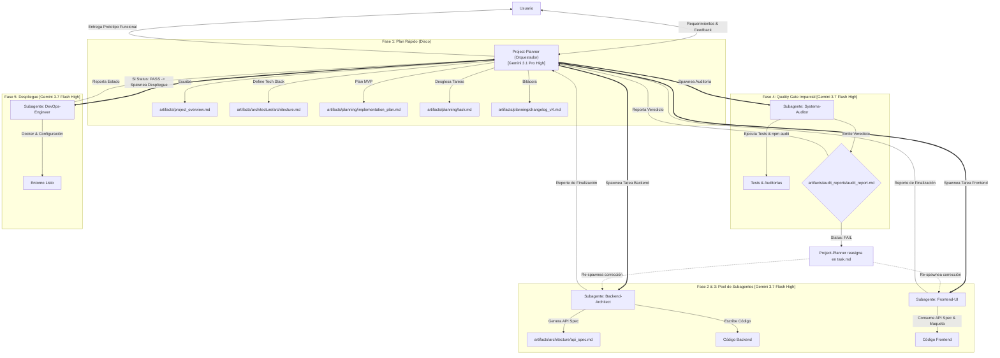

# Ecosistema de Agentes: Prototipado Evolutivo, Subagentes & Quality Gate (V6 Teamwork)

Hemos evolucionado la arquitectura de tus 5 agentes hacia el modelo **Orquestador-Subagentes (Teamwork)** de Google Antigravity. En lugar de alternar roles secuenciales en una misma ventana de chat (lo que saturaba el contexto y provocaba amnesia), ahora operamos con un **Agente Director/Orquestador** y un **Pool de Subagentes Especializados** con contextos aislados, comunicados a través de un **Bus Central de Artefactos** en disco.

---

## 🧠 Matriz de Modelos de Inteligencia Artificial

Para maximizar la capacidad de razonamiento estratégico y la eficiencia en la ejecución técnica, se define la siguiente asignación de modelos:

| Agente / Rol | Tipo de Ejecución | Modelo Asignado | Razón Técnica de Selección |
| :--- | :--- | :--- | :--- |
| **Project-Planner** | **Agente Principal (Orquestador)** | **Gemini 3.1 Pro (High)** | Máxima profundidad de razonamiento, visión holística del proyecto, control de alcance (YAGNI) y planificación a largo plazo sin alucinación. |
| **Backend-Architect** | **Subagente Autónomo** | **Gemini 3.7 Flash (High)** | Velocidad de codificación ultra rápida, alta precisión en consultas de base de datos, API specs y lógica de negocio en contexto aislado. |
| **Frontend-UI** | **Subagente Autónomo** | **Gemini 3.7 Flash (High)** | Agilidad en maquetación de componentes, integración fluida de tokens de diseño y control estricto de nodos de renderizado DOM. |
| **Systems-Auditor** | **Subagente Autónomo (QA)** | **Gemini 3.7 Flash (High)** | Ejecución implacable y neutral de pruebas automatizadas, auditoría de dependencias y análisis estático sin sesgos de autoría. |
| **DevOps-Engineer** | **Subagente Autónomo** | **Gemini 3.7 Flash (High)** | Creación rápida de imágenes Docker, recetas de CI/CD y despliegues reproducibles bajo demanda. |

---

## 👥 Resumen de Agentes y Dinámica de Subagentes

### 1. Project-Planner (El Orquestador Principal)
* **Rol:** Tech Lead y Orquestador General.
* **Modelo:** `Gemini 3.1 Pro (High)`.
* **Entorno:** Chat Principal / Mesa de Control.
* **Misión:** 
  * Recibir requerimientos del usuario y evaluar el alcance bajo **YAGNI**.
  * Traducir la necesidad en ciclos de **Prototipado Evolutivo**.
  * Definir el Tech Stack en `architecture.md`, redactar `implementation_plan.md` y desglosar tareas en `task.md`.
  * **Spawning de Subagentes:** En lugar de codificar, lanza subagentes especializados pasándoles las tareas atómicas y supervisa su finalización.
* **Entregables:**
  * `artifacts/project_overview.md` (Índice y resumen principal)
  * `artifacts/architecture/architecture.md` (Tech Stack y Diagramas)
  * `artifacts/planning/implementation_plan.md` (Plan del ciclo actual)
  * `artifacts/planning/task.md` (Checklist y asignación de subagentes)
  * `artifacts/planning/changelog_vX.md` (Historial oficial versionado)

### 2. Backend-Architect (Subagente Especialista en Datos)
* **Rol:** Arquitecto de Base de Datos y Lógica de Negocio.
* **Modelo:** `Gemini 3.7 Flash (High)`.
* **Entorno:** Subagente en Contexto Aislado.
* **Principios Clave:** Cero N+1, protección contra IDOR, y protocolo **No Blind Fixes**.
* **Entregables:** `artifacts/architecture/api_spec.md` y código fuente backend.

### 3. Frontend-UI (Subagente Especialista Visual)
* **Rol:** Ingeniero de Interfaz y Experiencia de Usuario.
* **Modelo:** `Gemini 3.7 Flash (High)`.
* **Entorno:** Subagente en Contexto Aislado.
* **Principios Clave:** Límite estricto de DOM (< 800 nodos sugerido, máx 1400), carga de skills de diseño (`refactoring-ui`, etc.) y protocolo **No Blind Fixes**.
* **Entregables:** Código Frontend, Componentes modulares y estilos.

### 4. Systems-Auditor (Subagente Quality Gatekeeper)
* **Rol:** QA Imparcial, Auditor de Seguridad y DevSecOps.
* **Modelo:** `Gemini 3.7 Flash (High)`.
* **Entorno:** Subagente en Contexto Aislado (Garantiza cero sesgo del desarrollador).
* **Principios Clave:** Suites de pruebas automatizadas, auditoría de dependencias (`npm audit` / `composer audit`), verificación de límites de DOM.
* **Entregables:** Suites de pruebas (`tests/...`) y `artifacts/audit_reports/audit_report.md` con el veredicto final (`Status: PASS` o `Status: FAIL`).

### 5. DevOps-Engineer (Subagente de Despliegue Controlado)
* **Rol:** Experto en Infraestructura y Contenedores.
* **Modelo:** `Gemini 3.7 Flash (High)`.
* **Entorno:** Subagente en Contexto Aislado.
* **Regla Estricta:** Solo se activa si `audit_report.md` tiene `Status: PASS`.
* **Entregables:** `docker-compose.yml`, `Dockerfile` y configuración CI/CD.

---

## 📂 Sistema de Archivos (Artifact-Driven Bus)

La memoria compartida del equipo no depende del historial del chat, sino de los archivos físicos en disco dentro de `artifacts/`:

```
📁 artifacts/
  📄 project_overview.md
  📁 architecture/
    📄 architecture.md
    📄 api_spec.md
  📁 planning/
    📄 implementation_plan.md
    📄 task.md
    📄 changelog_vX.md
  📁 audit_reports/
    📄 audit_report.md
```

---

## 🔄 Flujo de Orquestación con Subagentes (Teamwork)



---

## 🔗 Habilidades Base del Ecosistema
*(Ubicadas en `.agents/skills/`)*
- `project-planner/SKILL.md`
- `backend-architect/SKILL.md`
- `frontend-ui/SKILL.md`
- `systems-auditor/SKILL.md`
- `devops-engineer/SKILL.md`

