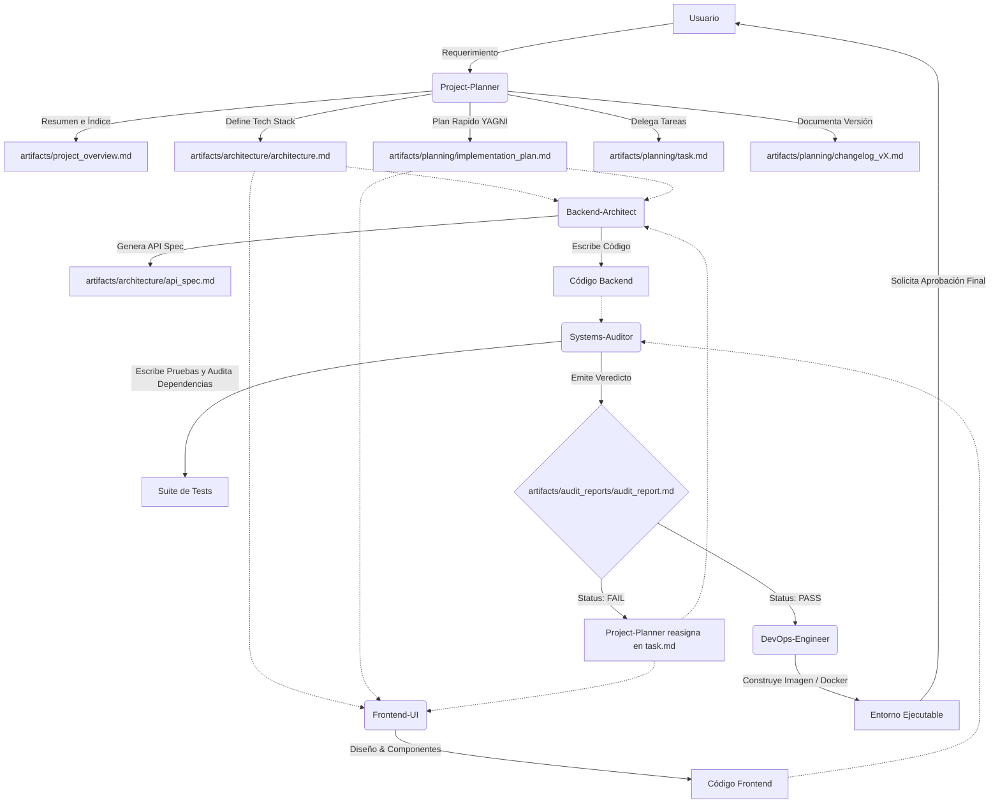

# Ecosistema de Agentes: Prototipado Evolutivo & Quality Gate (V5 Final)

Hemos perfeccionado la arquitectura de tus 5 agentes. Mantienen un sistema magro (sin añadir agentes extra), pero fortalecen el control de calidad mediante un **Quality Gate estricto**, protocolos **anti-alucinación** y una **gestión de artefactos centralizada** orientada a la escalabilidad a largo plazo (SDLC).

---

## 👥 Resumen de Agentes y sus Roles (Actualizado)

### 1. Project-Planner (El Orquestador)
* **Rol:** Tech Lead y Planificador.
* **Principios Clave:** 
  * **YAGNI (You Aren't Gonna Need It):** Mantiene la arquitectura estrictamente al mínimo necesario.
  * **Gestión de Contexto:** Gestiona el historial cerrando versiones mayores y abriendo nuevas (ej. de `changelog_v1.md` a `changelog_v2.md`).
* **Misión:** Traducir requerimientos en ciclos de prototipado iterativo y definir el *Tech Stack* oficial de la iteración en `architecture.md`.
* **Entregables:** Genera todo dentro de la carpeta `artifacts/`:
  * `artifacts/project_overview.md` (Índice y resumen principal del proyecto)
  * `artifacts/architecture/architecture.md` (Tech Stack y Diagramas)
  * `artifacts/planning/implementation_plan.md` (Plan del ciclo actual)
  * `artifacts/planning/task.md` (Checklist y asignación de tareas)
  * `artifacts/planning/changelog_vX.md` (Historial oficial de cambios versionado)

### 2. Backend-Architect (El Especialista en Datos)
* **Rol:** Arquitecto de Base de Datos y Lógica de Negocio.
* **Principios Clave:** 
  * Tolerancia cero a N+1 y vulnerabilidades IDOR.
  * Adopción estricta del Tech Stack definido en `architecture.md`.
  * **No Blind Fixes:** Prohibido arreglar fallos de testing "a ciegas" sin inyectar logs antes.
* **Entregables:** `artifacts/architecture/api_spec.md` y código fuente backend.

### 3. Frontend-UI (El Especialista Visual)
* **Rol:** Ingeniero de Interfaz y Experiencia de Usuario.
* **Principios Clave:** 
  * Límites duros del DOM (< 800 nodos sugerido, máximo 1400 nodos).
  * Adopción estricta del Tech Stack y uso de skills de diseño (`refactoring-ui`, etc.).
  * **No Blind Fixes:** Obligado a leer logs/errores antes de parchear vistas defectuosas.
* **Entregables:** Código Frontend, Componentes y estilos.

### 4. Systems-Auditor (Quality Gate & Test Automation)
* **Rol:** QA, Auditor de Seguridad y DevSecOps.
* **Principios Clave:** 
  * Escribe suites de pruebas (Unit, Integration, E2E).
  * Audita límites de DOM (> 1400 falla el despliegue).
  * **Auditoría de Dependencias:** Obligado a correr `npm audit` / `composer audit`. Falla el QA si hay vulnerabilidades altas.
* **Entregables:** Suites de pruebas (`tests/...`) y `artifacts/audit_reports/audit_report.md` con el veredicto final (`PASS` o `FAIL`).

### 5. DevOps-Engineer (Despliegue Controlado)
* **Rol:** Experto en Infraestructura y Contenedores.
* **Principios Clave:** 
  * **Regla Estricta:** No despliega NADA si el `audit_report.md` no tiene `Status: PASS`.
  * Avisa al Planner si el contenedor de Docker falla en el build por falta de dependencias.
* **Entregables:** `docker-compose.yml`, `Dockerfile`, y configuración de CI/CD.

---

## 📂 Sistema de Archivos (Artifact-Driven Workflow)
Todos los agentes tienen estrictamente prohibido intentar ejecutar planes sin haber guardado sus resultados físicos en el disco dentro del directorio `artifacts/`:

```
📁 artifacts/
  📄 project_overview.md
  📁 architecture/
    📄 architecture.md
    📄 api_spec.md
  📁 planning/
    📄 implementation_plan.md
    📄 task.md
    📄 changelog_vX.md
  📁 audit_reports/
    📄 audit_report.md
```

---

## 🔄 Flujo de Interconexión Estricto

Así interactúan los artefactos y agentes en cada iteración de versión:



## 🔗 Archivos Base (Plantillas Actualizadas)
*(Ubicadas en `Cositas/Agentes de Desarrollo de Software/.agents/skills/`)*
- `project-planner/SKILL.md`
- `backend-architect/SKILL.md`
- `frontend-ui/SKILL.md`
- `systems-auditor/SKILL.md`
- `devops-engineer/SKILL.md`
