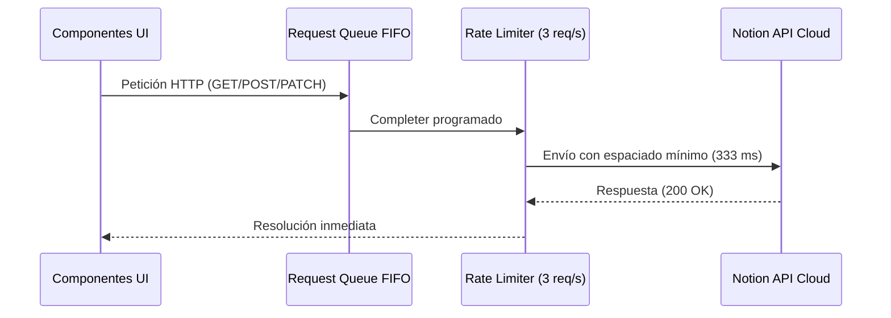

# 📡 Especificación de API y Contrato de Datos (v2.7.2)

Documento técnico elaborado por el rol **Backend-Architect** que formaliza los contratos de datos, modelos de entidad, esquemas de propiedades en Notion, endpoints REST consumidos y mecanismos de rate limiting y persistencia local.

---

## 🗄️ Esquema de la Base de Datos (Notion Database Schema)

La base de datos principal reside en Notion. Cada registro (fila) es una `Page` cuyas propiedades (`properties`) siguen la siguiente estructura canónica:

| Propiedad Notion | Tipo Notion | Tipo Dart | Valores / Rango | Descripción |
| :--- | :--- | :--- | :--- | :--- |
| **`Título`** | `title` | `String` | Texto no vacío | Nombre oficial del videojuego |
| **`Estado`** | `status` / `select` | `String` | `'Por jugar'`, `'Jugando'`, `'Jugado'` | Estado actual de avance del jugador |
| **`Plataforma`** | `select` | `String?` | `'PC'`, `'Playstation 5'`, `'Nintendo Switch'`, etc. | Plataforma en la que se disfruta el juego |
| **`Horas Jugadas`** | `number` | `num` | $\ge 0$ | Horas acumuladas de partida registradas |
| **`Calificación`** | `select` | `String?` | `'⭐'` a `'⭐⭐⭐⭐⭐'` | Puntuación personal en estrellas |
| **`Fecha de Inicio`** | `date` | `DateTime?` | Formato ISO 8601 (`YYYY-MM-DD`) | Fecha en que se inició la aventura |
| **`Fecha de Culminación`** | `date` | `DateTime?` | Formato ISO 8601 (`YYYY-MM-DD`) | Fecha en que se finalizó el juego |
| **`HLTB Principal`** | `number` | `num?` | $\ge 0$ | Horas estimadas HowLongToBeat (Main Story) |
| **`HLTB Extra`** | `number` | `num?` | $\ge 0$ | Horas estimadas HLTB (Main + Extras) |
| **`HLTB 100%`** | `number` | `num?` | $\ge 0$ | Horas estimadas HLTB (Completionist) |
| **`Géneros`** | `multi_select` | `List<String>` | Lista de etiquetas | Géneros y temáticas del título |
| **`Portada`** | `files` | `String?` | URL HTTP/HTTPS externa | Enlace a la imagen de portada en alta resolución |
| **`Reseña / Notas`** | `rich_text` | `String?` | Texto plano / Markdown | Comentario personal, análisis y recuerdos |

---

## 🌐 Endpoints de la API de Notion (`v1`)

- **Base URL:** `https://api.notion.com/v1`
- **Headers Obligatorios:**
  - `Authorization: Bearer <notion_internal_token>`
  - `Notion-Version: 2022-06-28`
  - `Content-Type: application/json`

### 1. Consultar Base de Datos (`POST /databases/{database_id}/query`)
- **Propósito:** Recuperar todos los juegos registrados con ordenamiento cronológico.
- **Request Body:**
  ```json
  {
    "page_size": 100,
    "sorts": [
      {
        "timestamp": "last_edited_time",
        "direction": "descending"
      }
    ],
    "start_cursor": "string (opcional para paginación Notion)"
  }
  ```
- **Respuesta:** `200 OK` con `{ "results": [ ... ], "has_more": false, "next_cursor": null }`.

### 2. Crear Juego / Página (`POST /pages`)
- **Propósito:** Registrar un nuevo juego desde el buscador RAWG en la base de datos de Notion.
- **Request Body:**
  ```json
  {
    "parent": { "database_id": "DATABASE_UUID" },
    "properties": {
      "Título": { "title": [{ "text": { "content": "Elden Ring" } }] },
      "Estado": { "status": { "name": "Jugando" } },
      "Plataforma": { "select": { "name": "PC" } },
      "Horas Jugadas": { "number": 12.5 },
      "Fecha de Inicio": { "date": { "start": "2026-08-26" } },
      "Géneros": { "multi_select": [{ "name": "RPG" }, { "name": "Soulslike" }] },
      "Portada": { "files": [{ "name": "Cover", "type": "external", "external": { "url": "https://..." } }] },
      "HLTB Principal": { "number": 58 }
    }
  }
  ```
- **Respuesta:** `200 OK` con el objeto `Page` recién creado y su `id`.

### 3. Actualizar Propiedades del Juego (`PATCH /pages/{page_id}`)
- **Propósito:** Incrementar horas (`+1h`), cambiar estado, editar calificación, fechas o notas.
- **Request Body:**
  ```json
  {
    "properties": {
      "Horas Jugadas": { "number": 13.5 },
      "Estado": { "status": { "name": "Jugado" } },
      "Fecha de Culminación": { "date": { "start": "2026-08-26" } }
    }
  }
  ```
- **Respuesta:** `200 OK` con el objeto `Page` actualizado.

### 4. Validar Conexión y Base de Datos
- **`GET /users/me`:** Valida que el token interno de integración sea válido y tenga permisos activos.
- **`GET /databases/{database_id}`:** Valida que la base de datos exista y haya sido compartida con la integración.

---

## 🚦 Control de Concurrencia y Rate Limiting

Para cumplir estrictamente con los límites de Notion API (máximo 3 peticiones por segundo sin incurrir en errores `429 Too Many Requests`), el servicio `NotionService` implementa una cola FIFO de promesas:



---

## 💾 Capa de Persistencia Local y Caché Offline

Para garantizar un cold-start instantáneo (**0 ms**) y resiliencia total frente a caídas de red:
- **Key Local (`SharedPreferences`):** `notion_persistent_games_cache_v1`
- **Contenido:** JSON serializado con la lista de objetos `Page` de Notion.
### ⚡ Optimización Smart Sync & Timeout de Red
- **Head Check Ligero (1 solo registro):**
  - Endpoint: `POST /databases/{database_id}/query` con `page_size: 1` ordenado por `last_edited_time` descendente.
  - Lógica de Verificación: Se compara el `last_edited_time` del registro remoto con el primer elemento de la caché local persistida. Si coinciden, la biblioteca no sufrió alteraciones en la nube y se devuelven los datos locales en $\sim 0.35$ s, evitando descargar la base de datos completa.
- **Límite de Tiempo (HTTP Timeout):**
  - Todas las peticiones HTTP (`GET`, `POST`, `PATCH`) cuentan con un timeout estricto de **15 segundos**. En caso de agotarse el tiempo, la aplicación libera los recursos inmediatamente y utiliza la instantánea local sin bloquear la interfaz de usuario.

---

## 🎮 API de Metadatos RAWG

- **Base URL:** `https://api.rawg.io/api/games`
- **Endpoint:** `GET https://api.rawg.io/api/games?key={rawg_api_key}&search={query}&page_size=15`
- **Campos Mapeados:**
  - `name`: Título del juego.
  - `background_image`: URL de carátula en alta definición.
  - `released`: Fecha de lanzamiento oficial.
  - `playtime`: Estimación de horas de duración promedio.
  - `genres`: Lista de géneros que se comparan y normalizan con la lista del catálogo interno.
