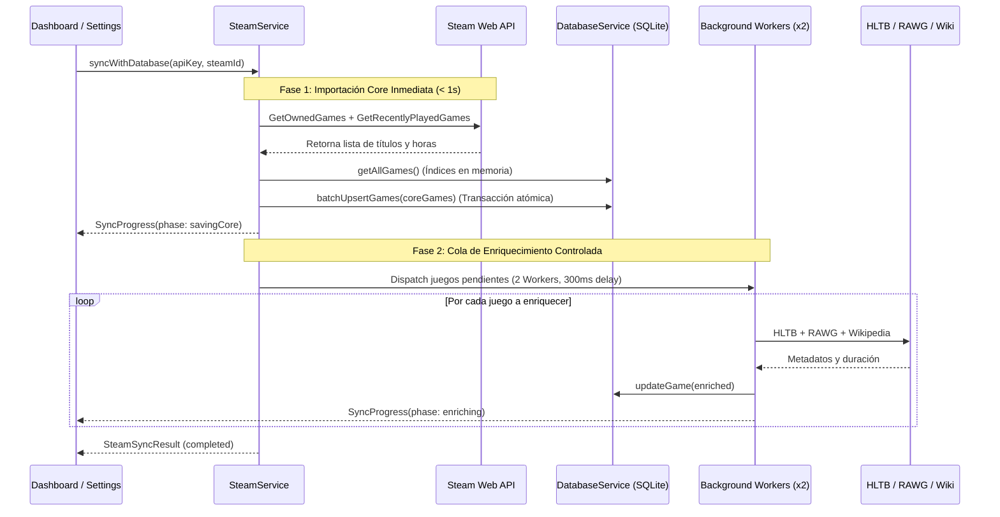

# 📡 Especificación de API y Contrato de Datos (v3.1.0 Local-First)

Documento técnico elaborado por el rol **Backend-Architect** que formaliza el esquema relacional de **SQLite local v2**, la capa de **Red Resiliente (`ResilientHttpClient`)**, los contratos de comunicación con **Steam Web API**, **HowLongToBeat API**, **RAWG API**, **Wikipedia Wikimedia API** y los mecanismos de serialización y respaldos offline de acuerdo con la arquitectura v3.1.0.

---

## 🗄️ Esquema Relacional de la Base de Datos Local (SQLite DDL v2)

El archivo de base de datos reside en el almacenamiento seguro de la aplicación (`app_game_tracker.db`).

### 1. Configuración de Pragmas de Integridad y Concurrencia (WAL Mode)
```sql
PRAGMA journal_mode = WAL;
PRAGMA synchronous = NORMAL;
PRAGMA foreign_keys = ON;
```

### 2. Tabla Principal: `games` (Versión 2)
```sql
CREATE TABLE IF NOT EXISTS games (
    id TEXT PRIMARY KEY,                       -- UUIDv4 canónico
    title TEXT NOT NULL,                      -- Título oficial del juego (máx. 255 chars)
    cover_url TEXT,                           -- URL web remota o ruta absoluta local a archivo en covers/
    status TEXT NOT NULL DEFAULT 'Por jugar',  -- 'Por jugar', 'Jugando', 'Jugado'
    platform TEXT,                            -- 'PC', 'Playstation 5', 'Nintendo Switch', 'Xbox', etc.
    hours_played REAL DEFAULT 0.0,            -- Horas acumuladas (1 decimal, ej. 12.5)
    genres TEXT,                              -- Lista JSON serializada: '["Acción", "RPG", "Aventura"]'
    rating TEXT,                              -- '★' a '★★★★★' o NULL ('Sin calificar')
    hltb_main REAL,                           -- Horas estimadas historia principal HLTB
    hltb_completionist REAL,                  -- Horas estimadas completista HLTB
    summary TEXT,                             -- Reseña, reflexiones y notas personales (máx. 2000 chars)
    link TEXT,                                -- URL de referencia (Wikipedia o web oficial)
    start_date TEXT,                          -- Formato ISO 8601: 'YYYY-MM-DD'
    completed_date TEXT,                      -- Formato ISO 8601: 'YYYY-MM-DD'
    steam_id INTEGER,                         -- AppID oficial de Steam
    created_at TEXT NOT NULL,                 -- Fecha y hora de creación ISO 8601
    updated_at TEXT NOT NULL                  -- Fecha y hora de última modificación ISO 8601
);

-- Índices B-Tree de aceleración de consultas y ordenamientos (< 2 ms)
CREATE INDEX IF NOT EXISTS idx_games_steam_id ON games(steam_id);
CREATE INDEX IF NOT EXISTS idx_games_status ON games(status);
CREATE INDEX IF NOT EXISTS idx_games_platform ON games(platform);
CREATE INDEX IF NOT EXISTS idx_games_title ON games(title);
CREATE INDEX IF NOT EXISTS idx_games_title_nocase ON games(title COLLATE NOCASE);
CREATE INDEX IF NOT EXISTS idx_games_updated_at ON games(updated_at DESC);
CREATE INDEX IF NOT EXISTS idx_games_hours_played ON games(hours_played DESC);
CREATE INDEX IF NOT EXISTS idx_games_rating ON games(rating DESC, hours_played DESC);
CREATE INDEX IF NOT EXISTS idx_games_status_updated ON games(status, updated_at DESC);
```

### 3. Operaciones Atómicas Transaccionales (`DatabaseService.batchUpsertGames`)
```dart
Future<void> batchUpsertGames(List<Game> games) async {
  if (games.isEmpty) return;
  final db = await database;
  await db.transaction((txn) async {
    final batch = txn.batch();
    for (final game in games) {
      batch.insert(
        'games',
        game.toSqliteMap(),
        conflictAlgorithm: ConflictAlgorithm.replace,
      );
    }
    await batch.commit(noResult: true);
  });
}
```

---

## 🌐 Capa de Red Resiliente (`ResilientHttpClient`)

Módulo centralizado para todas las llamadas a APIs externas:
- **Pool de Conexiones:** Instancia persistente de `http.Client` reutilizada para evitar socket exhaustion.
- **Timeouts:** 10 segundos por defecto, configurable por endpoint.
- **Reintentos Automáticos:** 3 reintentos con retroceso exponencial (`initialDelay * 2^(attempt-1)`) ante respuestas HTTP `429`, `500`, `502`, `503`, `504` o excepciones transitorias `SocketException`, `TimeoutException`, `ClientException`.
- **Manejo de Rate Limiting:** Lectura del encabezado `Retry-After` en respuestas 429 para pausar la ejecución exactamente el tiempo solicitado por el servidor antes de reintentar.

---

## 🎮 Contrato de Endpoints: Steam Web API (`SteamService`)

### 1. Obtener Juegos Propios Comprados (`GetOwnedGames`)
- **Endpoint:** `GET https://api.steampowered.com/IPlayerService/GetOwnedGames/v0001/`
- **Construcción:** `Uri.https('api.steampowered.com', '/IPlayerService/GetOwnedGames/v0001/', {...})`
- **Parámetros:**
  - `key`: Steam Web API Key
  - `steamid`: SteamID64 (17 dígitos)
  - `include_appinfo`: `true`
  - `include_played_free_games`: `true`
  - `format`: `json`

### 2. Obtener Juegos Recientes & Family Sharing (`GetRecentlyPlayedGames`)
- **Endpoint:** `GET https://api.steampowered.com/IPlayerService/GetRecentlyPlayedGames/v0001/`
- **Construcción:** `Uri.https('api.steampowered.com', '/IPlayerService/GetRecentlyPlayedGames/v0001/', {...})`

### 3. Resolución de Vanity URL a SteamID64 (`ResolveVanityURL`)
- **Endpoint:** `GET https://api.steampowered.com/ISteamUser/ResolveVanityURL/v0001/`
- **Construcción:** `Uri.https('api.steampowered.com', '/ISteamUser/ResolveVanityURL/v0001/', {...})`

### 4. Arquitectura de Sincronización en 2 Fases


---

## ⏱️ Contrato de Endpoints: HowLongToBeat Native API (`HltbService`)

### 1. Inicialización de Sesión y Tokens de Seguridad
- **Endpoint:** `GET https://howlongtobeat.com/api/search/site/init`
- **Construcción:** `Uri.https('howlongtobeat.com', '/api/search/site/init', {'t': timestamp})`
- **Protección de Concurrencia:** Mutex asíncrono `_authFuture` para garantizar una única petición concurrente de token.

### 2. Búsqueda de Título y Extracción de Tiempos
- **Endpoint:** `POST https://howlongtobeat.com/api/search/site`
- **Construcción:** `Uri.https('howlongtobeat.com', '/api/search/site')`

---

## 🌐 Contrato de Endpoints: RAWG API (`MetadataService`)

- **Búsqueda & Portadas HD:** `GET https://api.rawg.io/api/games`
- **Construcción:** `Uri.https('api.rawg.io', '/api/games', {'key': rawgKey, 'search': cleanTitle, 'page_size': '1'})`

---

## 📚 Contrato de Endpoints: Wikimedia Wikipedia API (`MetadataService`)

- **Búsqueda Canónica:** `GET https://{lang}.wikipedia.org/w/api.php`
- **Construcción:** `Uri.https('$lang.wikipedia.org', '/w/api.php', {'action': 'query', 'list': 'search', 'srsearch': query, 'format': 'json', 'srlimit': '1'})`

---

## 📦 Contrato de Respaldo y Restauración JSON (v3.1.0)

Estructura canónica generada y consumida por `BackupService` con soporte de Scoped Storage:
```json
{
  "app": "Victor Engineer - Game Tracker",
  "version": "3.1.0",
  "exported_at": "2026-09-01T18:00:00.000Z",
  "total_records": 42,
  "games": [
    {
      "id": "550e8400-e29b-41d4-a716-446655440000",
      "title": "Elden Ring",
      "cover_url": "https://media.rawg.io/media/games/...",
      "status": "Jugado",
      "platform": "PC",
      "hours_played": 124.5,
      "genres": ["Action", "RPG", "Open World"],
      "rating": "★★★★★",
      "hltb_main": 58.5,
      "hltb_completionist": 133.0,
      "summary": "Una de las mejores experiencias de rol y acción de la historia.",
      "link": "https://es.wikipedia.org/wiki/Elden_Ring",
      "start_date": "2024-02-25",
      "completed_date": "2024-04-12",
      "steam_id": 1245620,
      "created_at": "2024-02-25T10:00:00.000Z",
      "updated_at": "2026-09-01T18:00:00.000Z"
    }
  ]
}
```

---

## 🔐 Especificación de Seguridad: Almacenamiento Cifrado (`SecureStorageService`)

| Clave Canónica | Tipo de Dato | Propósito | Servicio Consumidor |
| :--- | :--- | :--- | :--- |
| `steam_api_key` | `String` | Llave oficial de Steam Web API | `SteamService`, `SettingsController`, `DashboardController` |
| `rawg_key` | `String` | Llave de RAWG Video Games API | `MetadataService`, `SteamService`, `GameSearchController`, `SettingsController` |
| `notion_token` | `String` | Token de Integración Interna Notion | `NotionService`, `SettingsController` |

---

## 🎮 Contratos de Controladores MVC (`frontend/lib/controllers/`)

| Controlador | Clase Base | Métodos Clave | Servicios Inyectados |
| :--- | :--- | :--- | :--- |
| `DashboardController` | `ChangeNotifier` | `loadGames`, `refresh`, `setPage`, `setPageSize`, `setSearchQuery`, `setStatusFilter`, `setPlatformFilter`, `setGenreFilter`, `setSortOption`, `clearFilters`, `toggleViewMode`, `setGridCardExtent`, `quickAddHours`, `updateGameStatus` | `DatabaseService`, `SharedPreferences` |
| `GameDetailController` | `ChangeNotifier` | `setTitle`, `setStatus`, `setPlatform`, `setRating`, `setHours`, `addHours`, `setSummary`, `setCoverUrl`, `setLink`, `setHltbMain`, `setHltbCompletionist`, `setStartDate`, `setCompletedDate`, `toggleGenre`, `setGenres`, `fetchHltbData`, `fetchWikipediaLink`, `saveGame`, `deleteGame`, `exportSocialCardData` | `DatabaseService`, `HltbService`, `MetadataService` |
| `GameSearchController` | `ChangeNotifier` | `loadRawgKey`, `searchGames`, `clearSearch`, `addGameToLibrary` | `MetadataService`, `DatabaseService`, `SecureStorageService`, `HltbService` |
| `SettingsController` | `ChangeNotifier` | `loadSettings`, `saveRawgKey`, `saveSteamSettings`, `saveNotionToken`, `testSteamConnection`, `resolveSteamVanity`, `syncSteam`, `syncAllHltb`, `syncAllMetadata`, `exportBackup`, `importBackupFromFile`, `importBackupFromJsonString`, `getAvailableBackups`, `optimizeDatabase`, `clearAllGames` | `SecureStorageService`, `DatabaseService`, `SteamService`, `MetadataService`, `SharedPreferences` |
| `AnalyticsController` | `ChangeNotifier` | `loadAnalytics`, `setSelectedYear`, `setAnnualGoal`, `previousYear`, `nextYear` | `DatabaseService`, `SharedPreferences` |

---

## 🧩 Entidades y Helpers de Dominio (`frontend/lib/models/` y `services/`)

| Componente | Archivo | Responsabilidad | LoC |
| :--- | :--- | :--- | :--- |
| `Game` | `frontend/lib/models/game.dart` | Entidad de dominio pura, inmutable y testeable. Serialización SQLite/JSON, copyWith, applyPlaytimeProgress. | 187 |
| `GameSanitizer` | `frontend/lib/models/game_sanitizer.dart` | Límites defensivos, truncado de caracteres, clamp numérico y normalización de fechas/géneros. | 87 |
| `NotionParser` | `frontend/lib/services/notion_parser.dart` | Extracción y deserialización desacoplada de registros de Notion v2.x para respaldos legados. | 134 |


