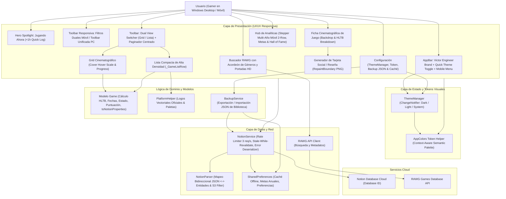
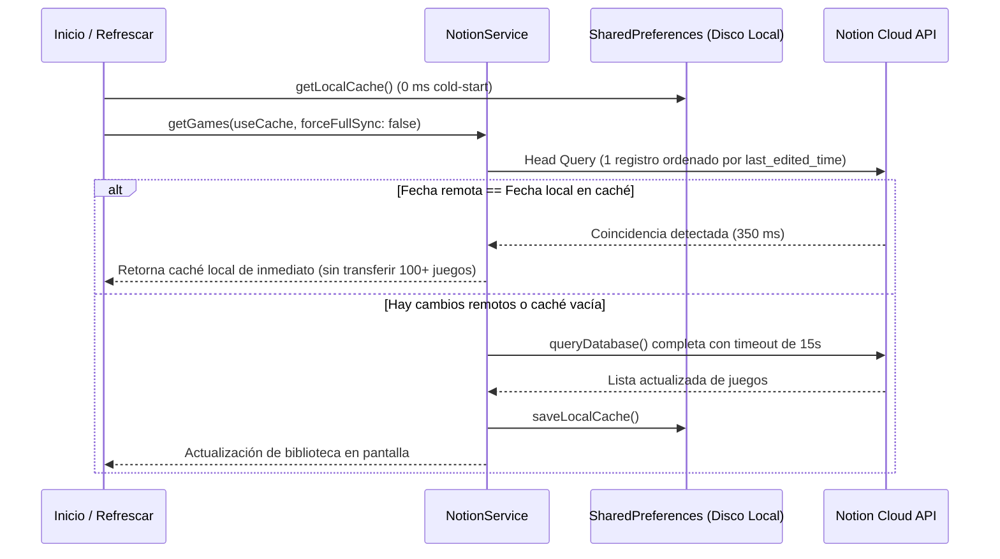

# 🏛️ Arquitectura del Sistema: Rastreador de Entretenimiento Personal (v3.0.0)

Documento maestro de arquitectura técnica del sistema, stack tecnológico, topología de componentes y patrones de diseño implementados bajo los estándares de **Victor Engineer** ([victorengineer.fyi](https://victorengineer.fyi)).

---

## 🛠️ Stack Tecnológico (v3.0.0 Local-First)

- **Frontend & Core:** Flutter 3.22+ / Dart SDK (`>= 3.2.0 < 4.0.0`).
- **Plataformas Soportadas:** Windows Desktop (x64 nativo) y Android (APK Fat / AAB).
- **Base de Datos Principal:** **SQLite 3 Local** (`sqflite: ^2.3.2` en Android y `sqflite_common_ffi: ^2.3.2+1` en Windows Desktop). Cero latencia (0 ms), sin límites de llamadas ni dependencia de servidores en la nube.
- **Sincronización de Tiempo Real:** **Steam Web API** (`IPlayerService`, `ISteamUser`) para sincronizar biblioteca oficial y horas de juego.
- **Servicio de Enriquecimiento:** **RAWG Video Games Database API** (búsqueda, carátulas HD y metadatos de más de 500k juegos).
- **Capa de Persistencia & Configuración:** SQLite para entidades de juego y `shared_preferences` para preferencias de usuario (claves de API, tema, metas anuales).
- **Capa de Respaldos:** `BackupService` con serialización/deserialización JSON de biblioteca completa y metadatos de configuración.
- **Seguridad & Firma Android:** `release.keystore` permanente (RSA 2048 / SHA-256) con validez hasta 2054 y versionado dinámico inyectado en CI/CD.
- **Licencia & Distribución:** Open Source bajo licencia MIT con releases automáticos en GitHub Actions.
- **Diseño & Identidad de Marca:** Sistema oficial **Victor Engineer**:
  - **Acento Primario:** Rojo Carmesí `#DC2626`.
  - **Tipografía:** Google Fonts `Outfit` (titulares, marcas, métricas) + `Inter` (cuerpo de texto, datos y tablas).
  - **Tema Oscuro (Obsidian Zinc):** `#09090B` fondo, `#121215` tarjetas, `#27272A` bordes.
  - **Tema Claro (Crisp Zinc):** `#FAFAFA` fondo, `#FFFFFF` tarjetas, `#E4E4E7` bordes, `#09090B` texto.
- **Exportación Gráfica:** `RepaintBoundary` con renderizado a 2.5x pixel ratio para generación de tarjetas PNG.
- **Dependencias Optimizadas (v2.8.3):** Cero dependencias muertas; eliminados `dio` y `flutter_staggered_grid_view`.

---

## 📐 Diagrama de Arquitectura Multicapa

---

## 🎨 Arquitectura del Sistema de Temas (`ThemeManager` & `AppColors`)

La aplicación implementa una arquitectura reactiva que desacopla los componentes visuales de los colores duros:

1. **`ThemeManager`:** Singleton que extiende `ChangeNotifier` y gestiona el `ThemeMode` activo (`dark`, `light`, `system`), persistiendo la clave `'preferred_theme_mode'` en `SharedPreferences`.
2. **`AppColors`:** Fachada estática que evalúa `Theme.of(context).brightness == Brightness.dark` para entregar colores semánticos (`background`, `surface`, `surfaceSubtle`, `border`, `textPrimary`, `textSecondary`, `textMuted`, `primary`).
3. **`AnimatedBuilder`:** En `main.dart`, envuelve el `MaterialApp` escuchando cambios en `ThemeManager.instance` para redibujar instantáneamente todas las vistas sin necesidad de recargar la aplicación.

---

## ⚡ Patrón de Caché Persistente & Smart Sync (*Stale-While-Revalidate*)

Para lograr tiempos de carga imperceptibles y evitar transferencias redundantes de red:

---

## 🛡️ Manejo de Portadas en Notion & Prevención de Error 400 (v2.8.4)

Cuando una imagen se sube directamente a Notion, Notion la aloja en servidores AWS S3 (`prod-files-secure.s3...`) clasificada como `type: file`. La API de Notion prohíbe enviar URLs de S3 bajo `type: external`, rechazándolo con HTTP 400 (`validation_error`).

### Estrategia de Blindaje Implementada:
1. **Detección de Cambio de Portada (`_saveChanges`):** Compara el valor del controlador con la portada original del juego. Si no hubo modificación (`coverChanged == false`), el campo `Portada` se omite del PATCH, preservando el archivo original en Notion.
2. **Filtro de Enlaces Internos (`toNotionProperties`):** Si una URL contiene `amazonaws.com`, `prod-files-secure` o `notion-static.com`, se bloquea su serialización como archivo externo.
3. **Deserialización de Errores (`NotionApiException`):** Parsea el campo `message` del JSON devuelto por Notion para exponer explicaciones claras y legibles en la interfaz de usuario en lugar de códigos opacos.

---

## 📱 Motor de Ergonomía y Responsividad Móvil (v2.8.1)

1. **Barra de Filtros en Doble Fila:**
   - En pantallas estrechas (< 600px), los estados se distribuyen en una fila superior y los menús desplegables (Plataforma, Género, Orden y Limpiar) se sitúan en una hilera inferior dedicada, eliminando desbordes horizontales.
2. **Escalado Inteligente de AppBar:**
   - `FittedBox` y `Flexible` protegen el logotipo Victor Engineer en pantallas < 500px, agrupando acciones secundarias en un menú popup `⋮`.
3. **Selector Anual 2-Row:**
   - En `AnalyticsScreen`, el stepper `< [Año] >` y el contador de juegos se dividen en dos hileras compactas para prevenir overflows en dispositivos móviles.

---

## 💾 Arquitectura del Servicio de Respaldo (`BackupService` v2.8.0)

Provee soberanía total de datos mediante exportación e importación offline:
- **Estructura JSON Canónica:** Almacena versión del esquema, estampa ISO 8601 y la lista completa de entidades `Game` con todos sus atributos serializados.
- **Restauración Inteligente:** Permite recargar la biblioteca en modo offline o sincronizar masivamente hacia Notion si se configura una nueva base de datos.
