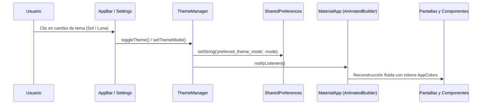
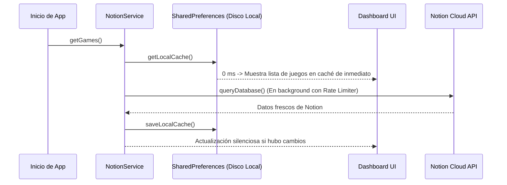

# 🏛️ Arquitectura del Sistema: Rastreador de Entretenimiento (v2.7.1)

Documento maestro de arquitectura técnica del sistema, stack tecnológico, topología de componentes y patrones de diseño implementados bajo los estándares de **Victor Engineer**.

---

## 🛠️ Stack Tecnológico

- **Frontend & Core:** Flutter 3.22+ / Dart SDK (`>= 3.2.0 < 4.0.0`).
- **Plataformas Soportadas:** Windows Desktop (x64 nativo) y Android (APK Fat / AAB).
- **Base de Datos Principal:** Notion API v1 (`2022-06-28`) consumida directamente vía HTTPS.
- **Servicio de Enriquecimiento:** RAWG Video Games Database API (búsqueda, carátulas HD y metadatos).
- **Capa de Red & Concurrencia:** `http` con cola FIFO de peticiones y rate limiter estricto (máximo 3 req/s).
- **Capa de Persistencia Local:** `shared_preferences` para credenciales, configuración de temas y caché offline persistente.
- **Diseño & Identidad de Marca:** Sistema oficial **Victor Engineer**:
  - **Acento Primario:** Rojo Carmesí `#DC2626`.
  - **Tipografía:** Google Fonts `Outfit` (titulares, marcas, métricas) + `Inter` (cuerpo de texto, datos y tablas).
  - **Tema Oscuro (Obsidian Zinc):** `#09090B` fondo, `#121215` tarjetas, `#27272A` bordes.
  - **Tema Claro (Crisp Zinc):** `#FAFAFA` fondo, `#FFFFFF` tarjetas, `#E4E4E7` bordes, `#09090B` texto.
- **Exportación Gráfica:** `RepaintBoundary` con renderizado a 2.5x pixel ratio para generación de tarjetas PNG.

---

## 📐 Diagrama de Arquitectura Multicapa

```mermaid
graph TD
    User["Usuario (Gamer en Windows Desktop / Móvil)"]

    subgraph Presentation["Capa de Presentación (UI/UX)"]
        AppBar["AppBar: Victor Engineer Brand + Quick Theme Toggle"]
        HeroSpotlight["Hero Spotlight: Jugando Ahora (+1h Quick Log)"]
        ViewSwitcher["Toolbar: Dual View Switcher (Grid / Lista) + Paginador"]
        GameGrid["Grid Cinematográfico (Cover Hover Scale & Progress)"]
        GameList["Lista Compacta de Alta Densidad (_GameListRow)"]
        DetailView["Ficha Cinematográfica de Juego (Backdrop & HLTB Breakdown)"]
        SocialCard["Generador de Tarjeta Social / Reseña (RepaintBoundary PNG)"]
        Analytics["Hub de Analíticas (Stepper Multi-Año, Metas & Hall of Fame)"]
        SearchModal["Buscador RAWG con Acordeón de Géneros y Portadas HD"]
        Settings["Configuración (Gestor de Temas 3-Way, Token & Caché)"]
    end

    subgraph StateAndTheme["Capa de Estado y Tokens Visuales"]
        ThemeMgr["ThemeManager (ChangeNotifier: Dark / Light / System)"]
        AppCol["AppColors Token Helper (Context-Aware Semantic Palette)"]
    end

    subgraph Domain["Lógica de Dominio y Modelos"]
        GameModel["Modelo Game (Cálculo HLTB, Fechas, Estado, Puntuación)"]
        PlatformHlp["PlatformHelper (Logos Vectoriales Oficiales & Paletas)"]
    end

    subgraph Data["Capa de Datos y Red"]
        NotionSvc["NotionService (Rate Limiter 3 req/s, Stale-While-Revalidate)"]
        NotionPars["NotionParser (Mapeo Bidireccional JSON <-> Entidades)"]
        RAWGClient["RAWG API Client (Búsqueda y Metadatos)"]
        LocalStorage["SharedPreferences (Caché Offline, Metas Anuales, Vistas)"]
    end

    subgraph Cloud["Servicios Cloud"]
        NotionCloud["Notion Database Cloud (Database ID)"]
        RAWGCloud["RAWG Games Database API"]
    end

    User --> AppBar
    User --> HeroSpotlight
    User --> ViewSwitcher
    User --> DetailView
    User --> Analytics
    User --> SearchModal
    User --> Settings

    AppBar --> ThemeMgr
    Settings --> ThemeMgr
    Presentation --> AppCol
    ThemeMgr --> AppCol

    ViewSwitcher --> GameGrid
    ViewSwitcher --> GameList
    GameGrid --> GameModel
    GameList --> GameModel
    GameList --> PlatformHlp
    DetailView --> SocialCard

    Presentation --> NotionSvc
    SearchModal --> RAWGClient
    NotionSvc --> NotionPars
    NotionSvc --> LocalStorage
    NotionSvc --> NotionCloud
    RAWGClient --> RAWGCloud
```

---

## 🎨 Arquitectura del Sistema de Temas (`ThemeManager` & `AppColors`)

La aplicación implementa una arquitectura reactiva que desacopla los componentes visuales de los colores duros:

1. **`ThemeManager`:** Singleton que extiende `ChangeNotifier` y gestiona el `ThemeMode` activo (`dark`, `light`, `system`), persistiendo la clave `'preferred_theme_mode'` en `SharedPreferences`.
2. **`AppColors`:** Fachada estática que evalúa `Theme.of(context).brightness == Brightness.dark` para entregar colores semánticos (`background`, `surface`, `surfaceSubtle`, `border`, `textPrimary`, `textSecondary`, `textMuted`, `primary`).
3. **`AnimatedBuilder`:** En `main.dart`, envuelve el `MaterialApp` escuchando cambios en `ThemeManager.instance` para redibujar instantáneamente todas las vistas sin necesidad de recargar la aplicación.

---

## ⚡ Patrón de Caché Persistente (*Stale-While-Revalidate*)

Para lograr tiempos de carga imperceptibles y disponibilidad continua:

---

## 🧩 Componentes Modulares de la Versión v2.7.1

1. **`_GameCard` (Grid Cinematográfico):**
   - Miniatura a escala completa con `Hero` animation.
   - Micro-barra de progreso HLTB integrada en la carátula.
   - Indicador de estado con resplandor cromático y badge de calificación en estrellas.
   - Escala interactiva en hover (`1.05x`) con sombras reactivas según el tema.
2. **`_GameListRow` (Lista Compacta):**
   - Altura contenida de 54px para visualización de alta densidad.
   - Miniatura de portada de 36x48px con bordes redondeados.
   - Insignia de plataforma oficial mapeada por `PlatformHelper`.
   - Botón de incremento directo `+1h` con actualización optimista.
3. **Paginador Inteligente:**
   - Control dinámico de segmentación por página (10, 25, 50, 100 o Todos).
   - Prevención de desbordamiento de DOM o árbol de widgets masivo en bibliotecas extensas.
4. **Selector Multi-Año en Analíticas:**
   - Stepper temporal interactivo `< [Año] >` que recalcula retrospectivamente los logros o permite configurar metas anticipadas para años venideros (`annual_game_goal_${year}`).
   - Salón de la Fama con récords (*El Titán*, *Obra Maestra*, *Aventura Ágil*) y medidor de salud del backlog.
5. **Tarjeta Social de Reseña:**
   - Capturador gráfico en `GameDetailScreen` que sintetiza los metadatos de un juego terminado en una postal estética lista para ser compartida en foros o redes de videojuegos.
