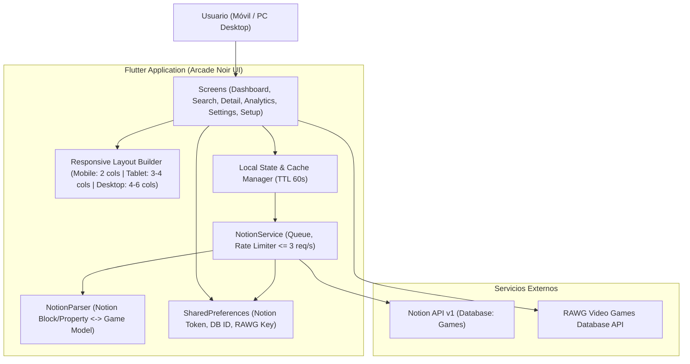

# 🏛️ Arquitectura del Sistema: Rastreador de Entretenimiento

## 🛠️ Stack Tecnológico

- **Frontend / Core:** Flutter 3.22+ (Dart >= 3.2.0 < 4.0.0)
- **Plataformas Soportadas:** Android (APK Fat) & Windows Desktop (PC x64)
- **Base de Datos / Backend Principal:** Notion API v1 (`2022-06-28`) con Internal Integration Token
- **Capa de Red:** `http` / `dio` con Rate Limiter encolado (3 req/s máx) y caché en memoria (TTL 60s)
- **Proveedor de Metadatos de Juegos:** RAWG Video Games Database API
- **Almacenamiento Local de Preferencias:** `shared_preferences` (Token de Notion, Database ID, RAWG Key)
- **Diseño & UI:** Sistema de diseño personalizado "Arcade Noir" (Google Fonts: *Space Grotesk* + *Inter*), componentes responsivos con soporte móvil y desktop.

---

## 📐 Diagrama de Arquitectura

---

## 🖥️ Estrategia Responsiva Desktop / PC

1. **Grid Responsivo en Dashboard:**
   - En lugar de `crossAxisCount: 2` estático, se utiliza `SliverGridDelegateWithMaxCrossAxisExtent(maxCrossAxisExtent: 220, childAspectRatio: 0.65)` o cálculo dinámico por ancho de pantalla.
2. **Modales y Diálogos con Constraints:**
   - Todos los diálogos (`showDialog`, modal bottom sheets) tendrán un ancho máximo acotado (`BoxConstraints(maxWidth: 550)`) centrado en pantallas panorámicas.
3. **CI/CD Multiplataforma:**
   - GitHub Actions para compilar APK de Android (`build_apk.yml`) y Ejecutable de Windows (`build_windows.yml`).
