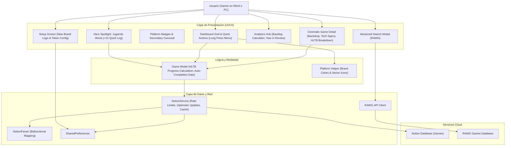

# 🏛️ Arquitectura del Sistema: Rastreador de Entretenimiento (v2.2)

## 🛠️ Stack Tecnológico

- **Frontend / Core:** Flutter 3.22+ (Dart >= 3.2.0 < 4.0.0)
- **Plataformas Soportadas:** Android (APK Fat) & Windows Desktop (PC x64)
- **Base de Datos / Backend:** Notion API v1 (`2022-06-28`) con Internal Integration Token
- **Capa de Red & Caché:** `http` con cola de peticiones / rate limiter (máx 3 req/s) y caché local en memoria con TTL
- **Servicio de Datos RAWG:** RAWG Video Games Database API
- **Persistencia de Configuración:** `shared_preferences`
- **Diseño & Branding:** Sistema "Arcade Noir" (Google Fonts *Space Grotesk* + *Inter*), paleta neón (Cyan `#00F0FF`, Magenta `#FF2D78`, Amber `#FFBE0B`), nuevo isotipo de entretenimiento y componentes modulares gamer.

---

## 📐 Diagrama de Componentes y Flujos

---

## 🎨 Componentes Clave de la Iteración v2.2

1. **Hero Spotlight Component:** Muestra el juego activo con mayor horas recientes, calculando `progreso = horasJugadas / hltbPrincipal`, barra de progreso neón y botón de registro rápido `+1h` con actualización optimista.
2. **Platform Vector & Badge Engine:** Diccionario visual de plataformas que mapea "PlayStation 5", "Nintendo Switch", "PC", "Xbox", etc. a iconos e insignias con paletas cromáticas auténticas.
3. **Cinematic Backdrop Header:** Renderiza un contenedor de fondo panorámico en `GameDetailScreen` con degradado vertical hacia el color de fondo `$bg-deep` (`#0A0E1A`).
4. **Calculadora de Backlog en Analíticas:** Algoritmo que suma `hltbMain` de los juegos con `status == 'Por jugar'` y genera métricas de tiempo estimado y velocidad de culminación anual.
