# 🏛️ Arquitectura del Sistema: Rastreador de Entretenimiento Personal (v3.1.0)

Documento maestro de arquitectura técnica del sistema, stack tecnológico, topología de componentes y patrones de diseño implementados bajo los estándares de **Victor Engineer** ([victorengineer.fyi](https://victorengineer.fyi)).

---

## 🛠️ Stack Tecnológico (v3.1.0 Local-First & Resiliente)

- **Frontend & Core:** Flutter 3.22+ / Dart SDK (`>= 3.2.0 < 4.0.0`).
- **Plataformas Soportadas:** Windows Desktop (x64 nativo) y Android (APK Fat / AAB con Scoped Storage).
- **Base de Datos Principal:** **SQLite 3 Local (WAL Mode)** (`sqflite: ^2.3.2` en Android y `sqflite_common_ffi: ^2.3.2+1` en Windows Desktop).
  - Configurado con `PRAGMA journal_mode = WAL;`, `PRAGMA synchronous = NORMAL;` y `PRAGMA foreign_keys = ON;`.
  - Memoización asíncrona `_initFuture` para eliminación total de condiciones de carrera (`database is locked`).
  - Índices B-Tree optimizados para consultas y ordenamientos en < 2 ms.
- **Capa de Red Resiliente:** `ResilientHttpClient` con pool persistente de conexiones, timeouts defensivos y reintentos con retroceso exponencial (*exponential backoff*) ante códigos HTTP 429/500/502/503/504.
- **Sincronización Steam Desacoplada:** Sincronización en dos fases (`SteamService`):
  - **Fase 1 (Core Batch):** Inserción/actualización atómica en lote mediante `DatabaseService.batchUpsertGames` (< 1 seg).
  - **Fase 2 (Enriquecimiento en Cola):** Worker pool de concurrencia controlada (2 workers, delay de 300 ms entre peticiones) para HLTB, Wikipedia y RAWG. Emisión de progreso continuo tipado (`SyncProgress`).
- **Servicio Nativo de Duración:** **HowLongToBeat Internal API** (`HltbService`) con cliente resiliente y rotación de tokens protegida por mutex asíncrono.
- **Servicios de Enriquecimiento:**
  - **RAWG Video Games Database API:** Búsqueda, carátulas HD y catálogo con todos los géneros sin límites.
  - **Wikipedia Wikimedia API:** Consulta cruzada bilingüe (`es`/`en`) con codificación canónica `Uri.https()`.
- **Capa de Persistencia & Configuración:** SQLite para entidades de juego, `flutter_secure_storage: ^9.2.2` para almacenamiento seguro y cifrado de claves API (Steam, RAWG, Notion), y `shared_preferences` para preferencias de usuario generales (tema, vista, metas anuales).
- **Capa de Respaldos Dinámicos:** `BackupService` con resolución dinámica de rutas mediante `path_provider` y `file_picker`, compatible con Scoped Storage en Android 10+ y carpetas de usuario en Windows.
- **Diseño & Identidad de Marca:** Sistema oficial **Victor Engineer**:
  - **Acento Primario:** Rojo Carmesí `#DC2626`.
  - **Tipografía:** Google Fonts `Outfit` (titulares, marcas, métricas) + `Inter` (cuerpo de texto, datos y tablas).
  - **Tema Oscuro (Obsidian Zinc):** `#09090B` fondo, `#121215` tarjetas, `#27272A` bordes.
  - **Tema Claro (Crisp Zinc):** `#FAFAFA` fondo, `#FFFFFF` tarjetas, `#E4E4E7` bordes, `#09090B` texto.

---

## 📐 Diagrama de Arquitectura Multicapa (v3.1.0)

```mermaid
graph TD
    User["Usuario (Gamer en Windows Desktop / Android)"]

    subgraph Presentation["Capa de Presentación (UI/UX Responsiva)"]
        AppBar["AppBar: Victor Engineer Brand + Steam Sync + Quick Theme Toggle"]
        HeroSpotlight["Hero Spotlight: Jugando Ahora (+1h Quick Log)"]
        FilterToolbar["Toolbar: Filtros de Estado, Plataforma, Género y Orden"]
        ViewSwitcher["Toolbar: Dual View Switcher (Grid / Lista) + Paginador Centrado"]
        GameGrid["Grid Cinematográfico (Cover Hover Scale & Progress)"]
        GameList["Lista Compacta de Alta Densidad (_GameListRow)"]
        DetailView["Ficha Cinematográfica de Juego (Backdrop, Wikipedia & HLTB Quick Lookup)"]
        PlatformSelector["Selector Visual de Plataformas (Chips Táctiles & Detección RAWG)"]
        SocialCard["Generador de Tarjeta Social / Reseña (RepaintBoundary PNG)"]
        Analytics["Hub de Analíticas (Stepper Multi-Año Móvil 2-Row, Metas & Hall of Fame)"]
        SearchModal["Buscador RAWG con Géneros Ilimitados y Enlace Wiki Automático"]
        Settings["Configuración (SQLite Vacuum, Steam Sync, HLTB Bulk Sync, RAWG Key & Backup JSON)"]
    end

    subgraph StateAndTheme["Capa de Estado y Tokens Visuales"]
        ThemeMgr["ThemeManager (ChangeNotifier: Dark / Light / System)"]
        AppCol["AppColors Token Helper (Context-Aware Semantic Palette)"]
    end

    subgraph Domain["Lógica de Dominio y Modelos"]
        GameModel["Modelo Game (Entidad Inmutable < 200 LoC, Patrón Sentinel copyWith, toSqliteMap)"]
        GameSanitizer["GameSanitizer (Límites Defensivos, Sanitización de Cadenas & Clamp Numérico)"]
        NotionParser["NotionParser (Parser Desacoplado de Registros Heredados de Notion v2.x)"]
        PlatformHlp["PlatformHelper (Logos Vectoriales Oficiales & Paletas de Fabricante)"]
        StringNorm["StringNormalizer (Fuzzy Similarity > 0.90 & Clean Title)"]
        BackupSvc["BackupService (Scoped Storage, JSON Export / Import)"]
    end

    subgraph Network["Capa de Red Resiliente"]
        ResilientHttp["ResilientHttpClient (Pool, Exponential Backoff, Rate-Limit 429/500 Retries)"]
    end

    subgraph Data["Capa de Datos Local-First & Concurrencia"]
        DatabaseSvc["DatabaseService (Singleton SQLite: WAL Mode, _initFuture Memoization, B-Tree Indexes v2, batchUpsertGames)"]
        SteamSvc["SteamService (2-Phase Sync: Phase 1 Batch Insert + Phase 2 Worker Queue Pool)"]
        HltbSvc["HltbService (Native Client: Mutex Token Cache & Extraction)"]
        MetadataSvc["MetadataService (RAWG Genres/Covers & Wikipedia Engine)"]
        SecureStorage["SecureStorageService (DPAPI / Keystore / Keychain: Claves Cifradas)"]
        LocalStorage["SharedPreferences (Metas Anuales, Preferencias UI)"]
    end

    subgraph CloudAPIs["Servicios Externos (On-Demand)"]
        SteamAPI["Steam Web API (GetOwnedGames, GetRecentlyPlayedGames, ResolveVanityURL)"]
        HLTBCloud["HowLongToBeat Internal REST API"]
        RAWGCloud["RAWG Video Games Database API"]
        WikiCloud["Wikimedia Wikipedia API (es/en)"]
    end

    User --> AppBar
    User --> HeroSpotlight
    User --> FilterToolbar
    User --> ViewSwitcher
    User --> DetailView
    User --> Analytics
    User --> SearchModal
    User --> Settings

    AppBar --> ThemeMgr
    Settings --> ThemeMgr
    Settings --> DatabaseSvc
    Settings --> BackupSvc
    Settings --> HltbSvc
    Presentation --> AppCol
    ThemeMgr --> AppCol

    ViewSwitcher --> GameGrid
    ViewSwitcher --> GameList
    GameGrid --> GameModel
    GameList --> GameModel
    GameList --> PlatformHlp
    DetailView --> SocialCard
    DetailView --> PlatformSelector
    DetailView --> HltbSvc
    DetailView --> MetadataSvc

    SearchModal --> MetadataSvc
    SearchModal --> HltbSvc
    SearchModal --> PlatformSelector

    AppBar --> SteamSvc
    Settings --> SteamSvc

    SteamSvc --> ResilientHttp
    HltbSvc --> ResilientHttp
    MetadataSvc --> ResilientHttp

    ResilientHttp --> SteamAPI
    ResilientHttp --> HLTBCloud
    ResilientHttp --> RAWGCloud
    ResilientHttp --> WikiCloud

    SteamSvc --> StringNorm
    SteamSvc --> HltbSvc
    SteamSvc --> MetadataSvc
    SteamSvc --> DatabaseSvc

    Presentation --> DatabaseSvc
    DatabaseSvc --> GameModel
    BackupSvc --> DatabaseSvc
    Settings --> LocalStorage
```



---

## 🧩 Patrones de Diseño Arquitectónicos Implementados

### 1. Patrón Sentinel para Soporte Completo de `NULL` en `copyWith`
Para permitir el borrado o vaciado explícito de propiedades opcionales (`link`, `coverUrl`, `summary`, `rating`, `hoursPlayed`, `genres`, `startDate`, `completedDate`, `steamId`, `createdAt`, `updatedAt`) sin que el operador `??` restaure accidentalmente los valores antiguos, el modelo `Game` implementa el patrón **Sentinel**:
```dart
static const Object _sentinel = Object();

Game copyWith({
  String? id,
  String? title,
  Object? coverUrl = _sentinel,
  String? status,
  Object? platform = _sentinel,
  Object? hoursPlayed = _sentinel,
  Object? genres = _sentinel,
  Object? rating = _sentinel,
  Object? hltbMain = _sentinel,
  Object? hltbCompletionist = _sentinel,
  Object? summary = _sentinel,
  Object? link = _sentinel,
  Object? startDate = _sentinel,
  Object? completedDate = _sentinel,
  Object? steamId = _sentinel,
  Object? createdAt = _sentinel,
  Object? updatedAt = _sentinel,
}) {
  ...
}
```

### 2. Concurrencia SQLite: WAL Mode y Memoización Asíncrona
Para soportar lecturas y escrituras simultáneas de alto rendimiento sin bloqueos:
- **WAL Mode (Write-Ahead Logging):** Lectores no bloquean escritores y escritores no bloquean lectores.
- **Memoización con `Future<Database>? _initFuture`:** Garantiza que múltiples llamadas concurrentes compartan la misma promesa de apertura sin disparar errores de `database is locked`.
- **Transacciones en Lote (`batchUpsertGames`):** Inserción masiva de cientos de registros dentro de una sola transacción atómica `db.transaction(...)` en < 50 ms.

### 3. Red Resiliente con Reintentos y Retroceso Exponencial (`ResilientHttpClient`)
- Pool persistente de conexiones reutilizables.
- Timeouts configurables por petición.
- Reintentos automáticos ante saturación (429) o fallos transitorios de red (500, 502, 503, 504) con cálculo de retardo exponencial `initialDelay * (multiplier ^ attempt)` y lectura del encabezado `Retry-After`.

### 4. Sincronización en Dos Fases con Worker Pool
- **Fase 1 (Core Inmediate):** Importación rápida (< 1s) e inserción en lote de datos directos de Steam.
- **Fase 2 (Enriquecimiento en Segundo Plano):** Worker pool con 2 workers en paralelo y retardo de 300 ms entre llamadas para evitar bloqueos por límite de tasa (rate limiting).

### 5. Capa de Controladores (Patrón Arquitectónico MVC)
Para desacoplar completamente la lógica de negocio y las consultas directas a servicios (`DatabaseService`, `SecureStorageService`, `BackupService`, `SharedPreferences`) de los widgets de presentación (Views), la arquitectura implementa la capa de Controladores en `frontend/lib/controllers/` extendiendo `ChangeNotifier`:
- **`DashboardController`:** Centraliza el estado de la biblioteca, paginación reactiva, filtros dinámicos (estado, plataforma, género, búsqueda, ordenamiento), zoom/modos de visualización y acciones rápidas (`quickAddHours`, `updateGameStatus`).
- **`GameDetailController`:** Gestiona el ciclo de vida del juego seleccionado, edición de campos, transiciones automáticas de estado (`applyPlaytimeProgress`), enriquecimiento bajo demanda (HLTB y Wikipedia), guardado en SQLite y datos para ficha social.
- **`GameSearchController`:** Orquesta la búsqueda externa en RAWG API, gestión de credenciales y la ingesta atómica de nuevos títulos enriquecidos en SQLite.
- **`SettingsController`:** Administra el almacenamiento seguro de credenciales con `SecureStorageService`, sincronizaciones masivas (Steam, HLTB, Metadatos), operaciones de respaldo/restauración JSON y mantenimiento de la base de datos (VACUUM / reseteo).
- **`AnalyticsController`:** Realiza el cálculo de métricas reactivas (distribución por estado, plataforma y género, horas totales, porcentaje de completado, calculadora de backlog, metas anuales multi-año y récords del Salón de la Fama).

