# 🏛️ Arquitectura del Sistema: Rastreador de Entretenimiento Personal (v3.0.5)

Documento maestro de arquitectura técnica del sistema, stack tecnológico, topología de componentes y patrones de diseño implementados bajo los estándares de **Victor Engineer** ([victorengineer.fyi](https://victorengineer.fyi)).

---

## 🛠️ Stack Tecnológico (v3.0.5 Local-First)

- **Frontend & Core:** Flutter 3.22+ / Dart SDK (`>= 3.2.0 < 4.0.0`).
- **Plataformas Soportadas:** Windows Desktop (x64 nativo) y Android (APK Fat / AAB).
- **Base de Datos Principal:** **SQLite 3 Local** (`sqflite: ^2.3.2` en Android y `sqflite_common_ffi: ^2.3.2+1` en Windows Desktop). Cero latencia (0 ms), sin límites de llamadas ni dependencia de servidores en la nube.
- **Sincronización Steam:** **Steam Web API** (`IPlayerService`, `ISteamUser`) para sincronizar biblioteca oficial, Family Sharing y horas jugadas.
- **Servicio Nativo de Duración:** **HowLongToBeat Internal API** (`HltbService`) con cliente HTTP directo y rotación transparente de tokens de seguridad.
- **Servicios de Enriquecimiento:**
  - **RAWG Video Games Database API:** Búsqueda, carátulas HD y catálogo de más de 500k juegos con todos los géneros sin límites.
  - **Wikipedia Wikimedia API:** Consulta cruzada bilingüe (`es`/`en`) con sanitización de títulos y cabeceras oficiales.
- **Capa de Persistencia & Configuración:** SQLite para entidades de juego y `shared_preferences` para preferencias de usuario (claves de API, tema, metas anuales).
- **Capa de Respaldos:** `BackupService` con serialización/deserialización JSON de biblioteca completa y metadatos de configuración.
- **Seguridad & Firma Android:** `release.keystore` permanente (RSA 2048 / SHA-256) con validez hasta 2054 y versionado dinámico inyectado en CI/CD.
- **Licencia & Distribución:** Open Source bajo licencia MIT con releases automáticos en GitHub Actions.
- **Diseño & Identidad de Marca:** Sistema oficial **Victor Engineer**:
  - **Acento Primario:** Rojo Carmesí `#DC2626`.
  - **Tipografía:** Google Fonts `Outfit` (titulares, marcas, métricas) + `Inter` (cuerpo de texto, datos y tablas).
  - **Tema Oscuro (Obsidian Zinc):** `#09090B` fondo, `#121215` tarjetas, `#27272A` bordes.
  - **Tema Claro (Crisp Zinc):** `#FAFAFA` fondo, `#FFFFFF` tarjetas, `#E4E4E7` bordes, `#09090B` texto.
- **Exportación Gráfica:** `RepaintBoundary` con renderizado a 2.5x pixel ratio para generación de tarjetas PNG.
- **Dependencias Optimizadas:** Cero dependencias muertas; eliminadas librerías huérfanas (`dio`, `flutter_staggered_grid_view`).

---

## 📐 Diagrama de Arquitectura Multicapa (v3.0.5)

```mermaid
graph TD
    User["Usuario (Gamer en Windows Desktop / Android)"]

    subgraph Presentation["Capa de Presentación (UI/UX Responsiva)"]
        AppBar["AppBar: Victor Engineer Brand + Steam Sync + Quick Theme Toggle"]
        HeroSpotlight["Hero Spotlight: Jugando Ahora (+1h Quick Log)"]
        FilterToolbar["Toolbar: Filtros de Estado, Plataforma, Género y Orden"]
        ViewSwitcher["Toolbar: Dual View Switcher (Grid / Lista) + Paginador Centrado"]
        GameGrid["Grid Cinematográfico (Cover Hover Scale & Progress)"]
        GameList["Lista Compacta de Alta Densidad (_GameListRow)"]
        DetailView["Ficha Cinematográfica de Juego (Backdrop, Wikipedia & HLTB Quick Lookup)"]
        PlatformSelector["Selector Visual de Plataformas (Chips Táctiles & Detección RAWG)"]
        SocialCard["Generador de Tarjeta Social / Reseña (RepaintBoundary PNG)"]
        Analytics["Hub de Analíticas (Stepper Multi-Año Móvil 2-Row, Metas & Hall of Fame)"]
        SearchModal["Buscador RAWG con Géneros Ilimitados y Enlace Wiki Automático"]
        Settings["Configuración (SQLite Vacuum, Steam Sync, HLTB Bulk Sync, RAWG Key & Backup JSON)"]
    end

    subgraph StateAndTheme["Capa de Estado y Tokens Visuales"]
        ThemeMgr["ThemeManager (ChangeNotifier: Dark / Light / System)"]
        AppCol["AppColors Token Helper (Context-Aware Semantic Palette)"]
    end

    subgraph Domain["Lógica de Dominio y Modelos"]
        GameModel["Modelo Game (Patrón Sentinel copyWith, Límites Defensivos, toSqliteMap)"]
        PlatformHlp["PlatformHelper (Logos Vectoriales Oficiales & Paletas de Fabricante)"]
        StringNorm["StringNormalizer (Fuzzy Similarity > 0.90 & Clean Title)"]
        BackupSvc["BackupService (Exportación / Importación JSON de Biblioteca)"]
    end

    subgraph Data["Capa de Datos Local-First & Red"]
        DatabaseSvc["DatabaseService (Singleton SQLite: B-Tree Indexes, CRUD, Vacuum)"]
        SteamSvc["SteamService (Dual Sync, 30-min Noise Filter, Family Sharing & HLTB Auto-Complete)"]
        HltbSvc["HltbService (Native HowLongToBeat Client: Tokens & Campaign/100% Extraction)"]
        MetadataSvc["MetadataService (RAWG Genres/Covers & Wikipedia Wikimedia Engine)"]
        LocalStorage["SharedPreferences (Claves API, Metas Anuales, Preferencias)"]
    end

    subgraph CloudAPIs["Servicios Externos (On-Demand)"]
        SteamAPI["Steam Web API (GetOwnedGames, GetRecentlyPlayedGames, ResolveVanityURL)"]
        HLTBCloud["HowLongToBeat Internal REST API"]
        RAWGCloud["RAWG Video Games Database API"]
        WikiCloud["Wikimedia Wikipedia API (es/en)"]
    end

    User --> AppBar
    User --> HeroSpotlight
    User --> FilterToolbar
    User --> ViewSwitcher
    User --> DetailView
    User --> Analytics
    User --> SearchModal
    User --> Settings

    AppBar --> ThemeMgr
    Settings --> ThemeMgr
    Settings --> DatabaseSvc
    Settings --> BackupSvc
    Settings --> HltbSvc
    Presentation --> AppCol
    ThemeMgr --> AppCol

    ViewSwitcher --> GameGrid
    ViewSwitcher --> GameList
    GameGrid --> GameModel
    GameList --> GameModel
    GameList --> PlatformHlp
    DetailView --> SocialCard
    DetailView --> PlatformSelector
    DetailView --> HltbSvc
    DetailView --> MetadataSvc

    SearchModal --> MetadataSvc
    SearchModal --> HltbSvc
    SearchModal --> PlatformSelector

    AppBar --> SteamSvc
    Settings --> SteamSvc

    SteamSvc --> SteamAPI
    SteamSvc --> StringNorm
    SteamSvc --> HltbSvc
    SteamSvc --> MetadataSvc
    SteamSvc --> DatabaseSvc

    HltbSvc --> HLTBCloud
    MetadataSvc --> RAWGCloud
    MetadataSvc --> WikiCloud

    Presentation --> DatabaseSvc
    DatabaseSvc --> GameModel
    BackupSvc --> DatabaseSvc
    Settings --> LocalStorage
```



---

## 🧩 Patrones de Diseño Arquitectónicos Implementados

### 1. Patrón Sentinel para Soporte Completo de `NULL` en `copyWith`
Para permitir el borrado o vaciado explícito de propiedades opcionales (`link`, `coverUrl`, `summary`, `rating`, `startDate`, `completedDate`) sin que el operador `??` restaure accidentalmente los valores antiguos, el modelo `Game` implementa el patrón **Sentinel**:
```dart
static const Object _sentinel = Object();

Game copyWith({
  String? id,
  String? title,
  Object? coverUrl = _sentinel,
  Object? summary = _sentinel,
  Object? link = _sentinel,
  Object? rating = _sentinel,
  ...
}) {
  return Game(
    id: id ?? this.id,
    title: title ?? this.title,
    coverUrl: identical(coverUrl, _sentinel) ? this.coverUrl : (coverUrl as String?),
    summary: identical(summary, _sentinel) ? this.summary : (summary as String?),
    link: identical(link, _sentinel) ? this.link : (link as String?),
    rating: identical(rating, _sentinel) ? this.rating : (rating as String?),
    ...
  );
}
```

### 2. Límites Defensivos de Memoria (Defensive Resource Clamping)
El modelo `Game` valida de forma transparente las entradas para garantizar que datasets masivos o respuestas de APIs de terceros nunca degraden el heap de memoria ni la base de datos:
- Título: truncado a 255 caracteres.
- Resumen/Notas: truncado a 2000 caracteres.
- URLs (portadas y enlaces): truncadas a 2048 caracteres.
- Géneros: máximo 20 géneros por juego, truncados a 50 caracteres cada uno.
- Horas jugadas y HLTB: clamped entre 0.0 y 99,999.0 horas.

### 3. Selector Visual de Plataformas con Detección Automática
- Al cargar los metadatos de RAWG, el sistema extrae las plataformas oficiales del juego (`rawgGame['platforms']`) y las normaliza mediante `_canonicalPlatform`.
- Se representan en pantalla mediante chips visuales con logotipos vectoriales oficiales provistos por `PlatformHelper`.
- Si el usuario requiere una plataforma alternativa (emuladores, GOG, Epic), el selector conmuta instantáneamente al catálogo global.
