# 🚀 Plan de Implementación y Hoja de Ruta de Refactorización (v3.2.0)
## Modularización de Monolitos, Poda Global de AI Slop y Consolidación de Arquitectura

**Proyecto:** App Game Tracker  
**Versión Objetivo:** v3.2.0  
**Fecha de Planificación:** 2026-09-02  
**Metodología:** Prototipado Evolutivo, Clean Architecture & Teamwork Subagent Orchestration  
**Roles Asignados:** `Backend-Architect`, `Frontend-UI`, `Systems-Auditor`, `DevOps-Engineer`  
**Referencias:** [[PRJ_App_Game_Tracker_project_overview|Visión General del Proyecto]], [[PRJ_App_Game_Tracker_task|Checklist de Tareas Atómicas]], [[PRJ_App_Game_Tracker_audit_report_refactor|Informe Diagnóstico de Auditoría]]

---

## 1. Visión General y Objetivos Estratégicos

El presente plan de implementación establece la hoja de ruta técnica para transformar la base de código de **App Game Tracker** (actualmente en 12,646 líneas distribuidas en 25 archivos) en una arquitectura modular, desacoplada, testeable y libre de "AI Slop" (comentarios didácticos obvios, wrappers redundantes, duplicación de lógica de negocio y monolitos de UI).

### 1.1 Objetivos Cuantitativos Principales
1. **Reducción Drástica de Monolitos de Pantalla:**
   - `frontend/lib/screens/dashboard.dart`: de **1,876 líneas a <300 líneas** (-84.0%).
   - `frontend/lib/screens/game_detail_screen.dart`: de **1,962 líneas a <300 líneas** (-84.7%).
   - `frontend/lib/screens/settings_screen.dart`: de **1,455 líneas a <220 líneas** (-84.9%).
   - `frontend/lib/screens/search_screen.dart`: de **1,162 líneas a <220 líneas** (-81.1%).
   - **Total en Pantallas Críticas:** Reducción combinada de **6,455 líneas a ~1,000 líneas** (-84.5%), extrayendo componentes cohesivos y reusables.
2. **Poda Integral de AI Slop:**
   - Eliminación del 100% de los comentarios didácticos redundantes (explicaciones obvias de sintaxis Dart, etiquetas de widgets elementales como `// Save button` o `// Rating`, y pseudocódigo numerado en métodos de estado).
3. **Eliminación de Duplicaciones de Dominio (DRY):**
   - Centralización de la asignación de colores y badges de estado (`StatusHelper`) unificando la lógica duplicada en 7 archivos.
   - Centralización de plataformas y géneros (`PlatformHelper` y `GenreHelper`), unificando listas hardcodeadas y la función normalizadora de 43 líneas `_canonicalPlatform`.
   - Encapsulación de la regla de negocio de auto-culminación y transición de estado en `Game.applyPlaytimeProgress`, eliminando la duplicación en 6 ubicaciones.
   - Eliminación de la llamada cruda a `http.get` en `search_screen.dart`, enrutando las búsquedas a través de `MetadataService.searchRawg` y `ResilientHttpClient`.
4. **Cero Regresiones y Quality Gate Certificado:**
   - 100% de pruebas automáticas pasando (`flutter test`).
   - Cero advertencias y cero errores en análisis estático estricto (`flutter analyze --fatal-infos`).
   - 100% de paridad funcional y visual (animaciones escalonadas, zoom Ctrl+Scroll, exportación de Social Card a PNG 2.5x, sincronización Steam en dos fases, selector de temas dinámico).

---

## 2. Diagrama de Arquitectura Objetivo (Antes vs. Después)

```mermaid
graph TD
    subgraph ANTES_v3_1 [Monolitos Acoplados v3.1.3]
        D_OLD[dashboard.dart<br>1,876 LoC] -->|Inlined UI, Filters & Dialogs| DB_OLD[(SQLite)]
        GD_OLD[game_detail_screen.dart<br>1,962 LoC] -->|Inlined Social Card, Forms & Pickers| DB_OLD
        S_OLD[settings_screen.dart<br>1,455 LoC] -->|Inlined Backup Dialog & Sync Loops| DB_OLD
        SR_OLD[search_screen.dart<br>1,162 LoC] -->|Inlined Ingestion Dialog & Raw HTTP| HTTP_RAW[Raw http.get]
    end

    subgraph DESPUES_v3_2 [Arquitectura Modular & Limpia v3.2.0]
        subgraph Screens [Orquestadores Ligeros <300 LoC]
            D_NEW[dashboard.dart<br><300 LoC]
            GD_NEW[game_detail_screen.dart<br><300 LoC]
            S_NEW[settings_screen.dart<br><220 LoC]
            SR_NEW[search_screen.dart<br><220 LoC]
        end

        subgraph Widgets_Dashboard [widgets/dashboard/]
            W_D1[DashboardAppBar]
            W_D2[DashboardFilterBar]
            W_D3[DashboardViewHeader]
            W_D4[QuickActionBottomSheet]
            W_D5[DashboardSkeletonGrid]
        end

        subgraph Widgets_GameDetail [widgets/game_detail/]
            W_GD1[SocialCardDialog]
            W_GD2[SocialCardPreview]
            W_GD3[GameDetailHeader]
            W_GD4[GameHltbProgressCard]
            W_GD5[GameGenreSelector]
            W_GD6[GameCoverPickerCard]
            W_GD7[GameDetailFormFields]
        end

        subgraph Widgets_Settings [widgets/settings/]
            W_S1[SettingsSectionHeader]
            W_S2[ThemeSettingsCard]
            W_S3[DatabaseSettingsCard]
            W_S4[SteamSettingsCard]
            W_S5[RawgSettingsCard]
            W_S6[HltbSettingsCard]
            W_S7[BackupSettingsCard]
            W_S8[ImportBackupDialog]
            W_S9[SyncSummaryDialog]
            W_S10[BrandingFooter]
        end

        subgraph Widgets_Search [widgets/search/]
            W_SR1[SearchBarInput]
            W_SR2[SearchEmptyState]
            W_SR3[SearchResultCard]
            W_SR4[GameDetailsPromptDialog]
            W_SR5[GameDetailsResult]
        end

        subgraph Foundation_Core [Dominio, Helpers & Servicios]
            H_STATUS[StatusHelper]
            H_PLAT[PlatformHelper<br>+canonicalize]
            H_GENRE[GenreHelper]
            M_GAME[Game Model<br>+applyPlaytimeProgress]
            S_META[MetadataService<br>+searchRawg, +bulkSync]
            S_HTTP[ResilientHttpClient]
            S_NORM[StringNormalizer]
        end

        D_NEW --> Widgets_Dashboard
        GD_NEW --> Widgets_GameDetail
        S_NEW --> Widgets_Settings
        SR_NEW --> Widgets_Search

        Widgets_Dashboard --> Foundation_Core
        Widgets_GameDetail --> Foundation_Core
        Widgets_Settings --> Foundation_Core
        Widgets_Search --> Foundation_Core
    end
```



---

## 3. Hoja de Ruta de 4 Fases de Refactorización

La refactorización se ejecutará en **4 fases secuenciales estrictas**. Cada fase debe culminar con análisis estático (`flutter analyze`) y suite de pruebas (`flutter test`) completamente en verde antes de avanzar a la siguiente.

---

### 🧱 FASE 1: Poda Global de AI Slop y Consolidación de Fundamentos

**Objetivo:** Establecer una base de dominio y utilidades limpia, DRY y robusta que sirva como cimiento para la modularización de los componentes de UI en las Fases 2 y 3.  
**Rol Primario:** `Backend-Architect`  
**Rol de Soporte:** `Systems-Auditor`  

#### 1.1 Centralización de Estados en `StatusHelper` (`frontend/lib/widgets/status_helper.dart`)
- **Problema:** Mapeo de colores (`Jugando` -> `0xFFDC2626`, `Por jugar` -> `0xFFF59E0B`, `Jugado` -> `0xFF10B981`), iconos y badges duplicado en 7 archivos (`analytics_screen.dart`, `dashboard.dart`, `game_detail_screen.dart`, `game_card_grid.dart`, `game_card_list.dart`, `steam_sync_dialog.dart`, `search_screen.dart`).
- **Solución Técnica:**
  Crear la clase utilitaria `StatusHelper` con métodos y constantes estáticas:
  ```dart
  class StatusHelper {
    static const String playing = 'Jugando';
    static const String backlog = 'Por jugar';
    static const String completed = 'Jugado';
    
    static const List<String> allStatuses = [playing, backlog, completed];
    
    static Color getColor(String? status);
    static IconData getIcon(String? status);
    static Widget buildStatusPill(BuildContext context, String? status);
    static Widget buildStatusChip({required String status, required bool isSelected, required ValueChanged<String> onSelected});
  }
  ```
- **Archivos a Actualizar:** Reemplazar implementaciones ad-hoc en los 7 archivos identificados.

#### 1.2 Unificación de Plataformas y Géneros (`PlatformHelper` y `GenreHelper`)
- **Problema:** Listas maestras de plataformas (`_platforms`, 15 items) y géneros (`_allGenres`, 30 items) repetidas en `game_detail_screen.dart` y `search_screen.dart`. Además, `search_screen.dart:48-90` contiene `_canonicalPlatform(String raw)` con 43 líneas de `if-else` redundantes.
- **Solución Técnica:**
  1. En `frontend/lib/widgets/platform_helper.dart`:
     - Exponer `static const List<String> allPlatforms = [...]`.
     - Añadir método `static String canonicalize(String rawPlatform)` absorbiendo y optimizando la lógica de normalización.
  2. En `frontend/lib/widgets/genre_helper.dart`:
     - Exponer `static const List<String> allGenres = [...]`.
     - Eliminar comentarios didácticos obvios (`// Red`, `// Emerald`, etc.).
- **Archivos a Actualizar:** `platform_helper.dart`, `genre_helper.dart`, `search_screen.dart`, `game_detail_screen.dart`.

#### 1.3 Encapsulación de Reglas de Negocio de Auto-Culminación en `Game` Model
- **Problema:** Las reglas de transición de estado:
  1. Si `hoursPlayed >= hltbMain` y `status != 'Jugado'` -> `status = 'Jugado'` y `completedDate = DateTime.now()`.
  2. Si `status == 'Por jugar'` y `hoursPlayed >= 1.0` -> `status = 'Jugando'` y `startDate = DateTime.now()`.
  Están replicadas en 6 ubicaciones distintas del código fuente.
- **Solución Técnica:**
  Añadir método puro en `frontend/lib/models/game.dart`:
  ```dart
  Game applyPlaytimeProgress({num? additionalHours, num? totalHours}) {
    final effectiveHours = totalHours ?? (hoursPlayed + (additionalHours ?? 0));
    String newStatus = status;
    DateTime? newStartDate = startDate;
    DateTime? newCompletedDate = completedDate;
    
    if (hltbMain != null && hltbMain! > 0 && effectiveHours >= hltbMain! && status != 'Jugado') {
      newStatus = 'Jugado';
      newCompletedDate ??= DateTime.now();
    } else if (status == 'Por jugar' && effectiveHours >= 1.0) {
      newStatus = 'Jugando';
      newStartDate ??= DateTime.now();
    }
    
    return copyWith(
      hoursPlayed: effectiveHours,
      status: newStatus,
      startDate: newStartDate,
      completedDate: newCompletedDate,
      updatedAt: DateTime.now(),
    );
  }
  ```
- **Archivos a Actualizar:** `metadata_service.dart`, `steam_service.dart`, `settings_screen.dart`, `dashboard.dart`, `game_detail_screen.dart`, `search_screen.dart`.

#### 1.4 Centralización de Sanitización de Strings y Enrutamiento de Búsqueda RAWG
- **Problema 1:** `MetadataService` y `GameDetailScreen` ejecutan regex manuales para limpiar títulos y nombres de archivo en lugar de usar `StringNormalizer`.
- **Problema 2:** `search_screen.dart` importa `package:http/http.dart` directamente y ejecuta peticiones crudas sin timeout ni backoff.
- **Solución Técnica:**
  1. Añadir `StringNormalizer.sanitizeFilename(String name)` y unificar limpieza de títulos con `StringNormalizer.cleanTitle(name)`.
  2. Implementar `MetadataService.searchRawgGames(String query, String rawgKey, {int pageSize = 15})` utilizando `ResilientHttpClient`.
  3. Desacoplar `http.dart` de `search_screen.dart`.

#### 1.5 Poda Global de Comentarios Didácticos (Slop Removal)
- **Problema:** 367 líneas de comentarios obvios de IA (`// Save button`, `// Title`, `// RepaintBoundary Card`, `// 1. Auto-culminación...`).
- **Solución Técnica:** Limpieza selectiva y rigurosa en todos los archivos de `frontend/lib/`, conservando únicamente comentarios de arquitectura y encabezados de archivo esenciales.

---

### 🎨 FASE 2: Modularización de Dashboard y Game Detail

**Objetivo:** Descomponer los dos monolitos principales (`dashboard.dart` con 1,876 líneas y `game_detail_screen.dart` con 1,962 líneas), reduciendo ambos a pantallas orquestadoras de **menos de 300 líneas** cada una mediante la extracción de 12 widgets especializados.  
**Rol Primario:** `Frontend-UI`  
**Rol de Soporte:** `Backend-Architect`  

#### 2.1 Descomposición Modular de `DashboardScreen` (`frontend/lib/screens/dashboard.dart`)
Target: **<300 LoC** (Reducción de ~1,580 líneas).

Extraer a `frontend/lib/widgets/dashboard/`:
1. **`dashboard_app_bar.dart` (~180 LoC):**
   - Contiene la barra superior responsiva, modo de búsqueda animada (`isSearchActive`), brand monogram "AGT", botón de alternancia de tema, disparador con spinner de sincronización de Steam, y `PopupMenuButton` adaptativo para móvil vs. fila de iconos para desktop.
   - Interface:
     ```dart
     class DashboardAppBar extends StatelessWidget implements PreferredSizeWidget {
       final bool isSearchActive;
       final TextEditingController searchController;
       final String searchQuery;
       final bool isRefreshing;
       final ValueChanged<String> onSearchQueryChanged;
       final VoidCallback onSearchToggle;
       final VoidCallback onClearSearch;
       final VoidCallback onSteamSync;
       final VoidCallback onRefresh;
       final VoidCallback onOpenAnalytics;
       final VoidCallback onOpenSettings;
     }
     ```
2. **`dashboard_filter_bar.dart` (~190 LoC):**
   - Contiene los chips de estado (`StatusHelper`), dropdown con badge de plataformas, dropdown con badge de géneros, dropdown de ordenamiento y botón para limpiar filtros. Soporta disposición responsiva (2 filas en móvil, 1 fila en desktop).
   - Interface:
     ```dart
     class DashboardFilterBar extends StatelessWidget {
       final String selectedStatus;
       final String selectedPlatform;
       final String selectedGenre;
       final String selectedSort;
       final List<FilterOption> platformOptions;
       final List<FilterOption> genreOptions;
       final int activeFiltersCount;
       final ValueChanged<String> onStatusSelected;
       final ValueChanged<String> onPlatformSelected;
       final ValueChanged<String> onGenreSelected;
       final ValueChanged<String> onSortSelected;
       final VoidCallback onClearFilters;
     }
     ```
3. **`dashboard_view_header.dart` (~140 LoC):**
   - Contiene el subheader con el contador de juegos encontrados (`_filteredGames.length` vs `_totalGamesCount`), chip de búsqueda activa, selector de vista dual (`Grid` / `Lista`), y controles de zoom estilo explorador de Windows (`-`, popup menú de tamaños, `+`).
4. **`quick_action_bottom_sheet.dart` (~140 LoC):**
   - Modal bottom sheet desacoplado para interacción rápida con un juego (miniatura, título, plataforma, horas, botones rápidos de estado usando `StatusHelper`, botón "+1 hora", y acceso directo al detalle).
   - Interface estática:
     ```dart
     class QuickActionBottomSheet {
       static Future<void> show({
         required BuildContext context,
         required Game game,
         required ValueChanged<num> onAddHours,
         required ValueChanged<String> onStatusChange,
         required VoidCallback onEditDetails,
       });
     }
     ```
5. **`dashboard_skeleton_grid.dart` (~65 LoC):**
   - Placeholder animado de carga (shimmer skeleton) durante la consulta SQLite.

#### 2.2 Descomposición Modular de `GameDetailScreen` (`frontend/lib/screens/game_detail_screen.dart`)
Target: **<300 LoC** (Reducción de ~1,660 líneas).

Extraer a `frontend/lib/widgets/game_detail/`:
1. **`social_card_dialog.dart` (~220 LoC):**
   - Diálogo modal interactivo para previsualizar y exportar la tarjeta social de juego en formato PNG de alta resolución (pixelRatio: 2.5), con selector de tema Claro/Oscuro y guardado en carpeta Downloads de Windows/Android.
   - Interface:
     ```dart
     class SocialCardDialog {
       static Future<void> show({
         required BuildContext context,
         required Game game,
         required String title,
         required num hoursPlayed,
         required String rating,
         required String summary,
         required String platform,
         required String status,
         DateTime? completedDate,
         String? coverUrl,
       });
     }
     ```
2. **`social_card_preview.dart` (~210 LoC):**
   - Widget visual puro que renderiza la tarjeta de reseña social (encabezado con monograma "AGT", título, calificación en estrellas, miniatura de portada con degradado, horas jugadas, fecha de culminación y cita de notas personales).
3. **`game_detail_header.dart` (~110 LoC):**
   - Cabecera cinematográfica con portada difuminada en el fondo (backdrop blur), tarjeta de portada central elevada con Hero animation, badge de plataforma y status pill (`StatusHelper`).
4. **`game_hltb_progress_card.dart` (~100 LoC):**
   - Tarjeta visual de progreso contra HowLongToBeat: barra animada `LinearProgressIndicator`, cálculo de porcentaje, hitos de Historia Principal vs. 100% Completista, y badge "Faltan ~Xh" / "Completado".
5. **`game_genre_selector.dart` (~130 LoC):**
   - Acordeón colapsable con contador de géneros seleccionados, animación de chevron y `Wrap` de `FilterChip` interactivos para los 30 géneros estándar provistos por `GenreHelper`.
6. **`game_cover_picker_card.dart` (~110 LoC):**
   - Componente para seleccionar portada desde disco local mediante `FilePicker`, copiado seguro a directorio de documentos de la aplicación (`app_documents/covers/`), y campo unificado de URL web (eliminando el campo de URL duplicado en el formulario).
7. **`game_detail_form_fields.dart` (~140 LoC):**
   - Bloques reutilizables para el formulario de detalle: `GameSectionHeader`, `QuickHourButton` (+30m, +1h, +2h), `GameDropdownField`, y `GameDatePickerField`.

---

### ⚙️ FASE 3: Modularización de Settings y Search

**Objetivo:** Modularizar las pantallas de configuración (`settings_screen.dart` con 1,455 líneas) y búsqueda/ingesta (`search_screen.dart` con 1,162 líneas), reduciendo ambas a **menos de 220 líneas** cada una mediante la extracción de 15 componentes especializados.  
**Rol Primario:** `Frontend-UI`  
**Rol de Soporte:** `Backend-Architect`  

#### 3.1 Descomposición Modular de `SettingsScreen` (`frontend/lib/screens/settings_screen.dart`)
Target: **<220 LoC** (Reducción de ~1,235 líneas).

1. **Delegación de Bucles Masivos de Sincronización:**
   - Extraer `_syncAllHltb` y `_syncAllMetadata` de `settings_screen.dart` y trasladar su ejecución a métodos de servicio en `MetadataService` (`syncAllHltbGames()` y `syncAllGamesMetadata()`).
2. **Extracción a `frontend/lib/widgets/settings/` (10 Widgets):**
   - `settings_section_header.dart` (~25 LoC): Título de sección estandarizado con tipografía Outfit y acento carmesí.
   - `theme_settings_card.dart` (~65 LoC): Selector interactivo de Modo Oscuro / Claro / Sistema con `AnimatedBuilder`.
   - `database_settings_card.dart` (~80 LoC): Indicador de base de datos SQLite local, conteo de juegos y horas, ruta del archivo, botón de refresco y optimización `VACUUM`.
   - `steam_settings_card.dart` (~110 LoC): Formulario de Steam API Key y SteamID/Vanity, resolución de vanity, prueba de conexión y botón de sincronización.
   - `rawg_settings_card.dart` (~70 LoC): Entrada de RAWG Key, ayuda de obtención de clave y botón de sincronización de portadas/metadatos.
   - `hltb_settings_card.dart` (~70 LoC): Tarjeta informativa de HowLongToBeat y disparador de sincronización masiva de duraciones.
   - `backup_settings_card.dart` (~70 LoC): Tarjeta de exportación e importación de respaldos JSON.
   - `import_backup_dialog.dart` (~180 LoC): Modal desacoplado que extrae la clase privada `_ImportBackupDialog` (selector con `FilePicker`, carga de dataset de prueba, lista de respaldos recientes y entrada de texto JSON directo).
   - `sync_summary_dialog.dart` (~55 LoC): Diálogo modal genérico y reutilizable para presentar resúmenes de sincronización (Steam, HLTB o RAWG), unificando los 3 diálogos alert idénticos.
   - `branding_footer.dart` (~50 LoC): Pie de página oficial con monograma Victor Engineer, versión del aplicativo y enlace al sitio web.

#### 3.2 Descomposición Modular de `SearchScreen` (`frontend/lib/screens/search_screen.dart`)
Target: **<220 LoC** (Reducción de ~940 líneas).

Extraer a `frontend/lib/widgets/search/` (5 Widgets):
1. **`search_bar_input.dart` (~60 LoC):**
   - Campo de texto con icono de lupa, debounce o envío por Enter, botón para limpiar consulta y spinner de actividad de red.
2. **`search_empty_state.dart` (~30 LoC):**
   - Vista centrada con icono de gamepad estilizado y texto de instrucción cuando no hay búsqueda activa.
3. **`search_result_card.dart` (~85 LoC):**
   - Tarjeta individual de resultado con portada remota cacheada, título del juego, año de lanzamiento, chips de género y botón carmesí "+" para agregar a la biblioteca.
4. **`game_details_prompt_dialog.dart` (~240 LoC):**
   - Modal completo de ingesta que extrae la clase masiva privada `_GameDetailsPromptDialog` (664 líneas): cabecera con portada y estimación HLTB, selector de estado inicial (`StatusHelper`), campo de horas jugadas, picker de fecha de inicio, selector de plataforma en `Wrap` usando `PlatformHelper`, y acordeón de géneros usando `GenreHelper`.
5. **`game_details_result.dart` (~25 LoC):**
   - Modelo tipado inmutable con los datos devueltos por el diálogo de ingesta (`status`, `platform`, `startDate`, `hoursPlayed`, `genres`).

---

### 🛡️ FASE 4: Verificación Integral de Calidad y Cero Regresiones

**Objetivo:** Ejecutar la batería completa de validación estática, pruebas automatizadas, pruebas de widgets nuevos, medición de LoC y auditoría formal de Quality Gate.  
**Rol Primario:** `Systems-Auditor`  
**Rol de Soporte:** `DevOps-Engineer`  

#### 4.1 Análisis Estático Estricto (`flutter analyze`)
- Ejecutar `flutter analyze --fatal-infos` en `frontend/`.
- **Criterio de Aprobación:** 0 errores, 0 advertencias, 0 sugerencias (Clean Analysis).

#### 4.2 Ejecución y Enriquecimiento de la Suite de Pruebas (`flutter test`)
- Ejecutar los 11 archivos de prueba existentes verificando 100% de éxito:
  - `backup_service_test.dart`, `database_service_test.dart`, `game_model_test.dart`, `hltb_service_test.dart`, `metadata_service_test.dart`, `resilient_http_client_test.dart`, `secure_storage_service_test.dart`, `steam_service_test.dart`, `string_normalizer_test.dart`, `app_cover_image_test.dart`, `dashboard_widgets_test.dart`.
- Crear nuevas pruebas unitarias y de widgets:
  1. `frontend/test/status_helper_test.dart`: Validación de colores, iconos, pills y chips de estado.
  2. `frontend/test/game_progress_test.dart`: Validación exhaustiva del método `Game.applyPlaytimeProgress` para todos los casos límite (transición automática a 'Jugado', transición a 'Jugando', preservación de fechas).
  3. `frontend/test/widgets/settings_widgets_test.dart`: Validación de renderizado y callbacks de `ThemeSettingsCard`, `DatabaseSettingsCard`, `BrandingFooter`, y `SyncSummaryDialog`.
  4. `frontend/test/widgets/search_widgets_test.dart`: Validación de `SearchBarInput`, `SearchResultCard`, y `GameDetailsPromptDialog`.
  5. `frontend/test/widgets/game_detail_widgets_test.dart`: Validación de `GameHltbProgressCard`, `GameGenreSelector`, y `SocialCardPreview`.

#### 4.3 Medición y Auditoría de Líneas de Código (LoC Reduction)
- Contabilizar el tamaño final de los archivos de pantalla:
  - `dashboard.dart` <= 300 LoC.
  - `game_detail_screen.dart` <= 300 LoC.
  - `settings_screen.dart` <= 220 LoC.
  - `search_screen.dart` <= 220 LoC.
- Confirmar la eliminación total de AI Slop y duplicaciones.

#### 4.4 Generación del Informe de Auditoría Final
- Redactar `artifacts/audit_reports/audit_report_refactor_v3.2.0.md` con veredicto formal `Status: PASS`.

---

## 4. Matriz de Asignación de Roles (Teamwork RACI)

| Componente / Tarea | `Backend-Architect` | `Frontend-UI` | `Systems-Auditor` | `DevOps-Engineer` |
| :--- | :---: | :---: | :---: | :---: |
| **Poda de AI Slop & Comentarios** | **A / R** | **R** | C | I |
| **`StatusHelper` & Helpers Centralizados** | **A / R** | C | C | I |
| **`Game.applyPlaytimeProgress` & Lógica de Negocio** | **A / R** | C | C | I |
| **Servicio de Búsqueda RAWG & Sync Loops** | **A / R** | C | C | I |
| **Modularización de `DashboardScreen` (5 Widgets)** | C | **A / R** | C | I |
| **Modularización de `GameDetailScreen` (7 Widgets)** | C | **A / R** | C | I |
| **Modularización de `SettingsScreen` (10 Widgets)** | C | **A / R** | C | I |
| **Modularización de `SearchScreen` (5 Widgets)** | C | **A / R** | C | I |
| **Suite de Pruebas Unitarias y de Widgets** | R | R | **A / R** | I |
| **Análisis Estático (`flutter analyze`)** | C | C | **A / R** | I |
| **Quality Gate Audit (`audit_report.md`)** | I | I | **A / R** | I |
| **CI/CD Pipeline Sanity & Build Verification** | I | I | C | **A / R** |

*Leyenda: **A** = Accountable (Responsable directo), **R** = Responsible (Ejecutor), **C** = Consulted (Consultado), **I** = Informed (Informado).*

---

## 5. Gestión de Riesgos y Estrategia de Rollback

| Riesgo Técnico Identificado | Nivel de Severidad | Estrategia de Mitigación Preventiva | Procedimiento de Rollback / Contingencia |
| :--- | :---: | :--- | :--- |
| **Regresión en Animaciones o Gestos (Zoom Ctrl+Scroll en Dashboard)** | Medio | Mantener intactos los controladores de animación (`_pulseController`, `ScrollController`) y listeners en el State principal de `DashboardScreen`. | Revertir el archivo específico de widget `dashboard_view_header.dart` y verificar listener de zoom. |
| **Fallo en Exportación de Social Card (RenderRepaintBoundary)** | Medio | Preservar exactamente el árbol de renderizado, `GlobalKey`, y el multiplicador de píxeles (2.5x) en `SocialCardDialog` y `SocialCardPreview`. | Validar prueba de widget de renderizado de imagen y comprobación de captura PNG en disco. |
| **Ruptura de Estado en Formularios de Ajustes (RAWG/Steam Keys)** | Bajo | Asegurar que `TextEditingController` y la persistencia cifrada en `SecureStorageService` no se reinicialicen innecesariamente en los subwidgets. | Inspeccionar ciclo de vida de controladores en `SettingsScreen`. |
| **Incompatibilidad de Modelos en Ingesta de Búsqueda** | Bajo | Crear el modelo `GameDetailsResult` fuertemente tipado con valores por defecto seguros. | Inspeccionar mapeo en `search_screen.dart` y verificar con pruebas unitarias. |

---

## 6. Verificación de Cumplimiento de Reglas

- [x] Frontmatter YAML compatible con Obsidian presente.
- [x] 4 Fases estructuradas y detalladas.
- [x] Asignación explícita de subagentes (`Frontend-UI`, `Backend-Architect`, `Systems-Auditor`, `DevOps-Engineer`).
- [x] Límites de LoC estrictamente especificados (<300 LoC en Dashboard y Game Detail, <220 LoC en Settings y Search).
- [x] Ningún archivo en `frontend/lib/` ha sido modificado por el planificador.
